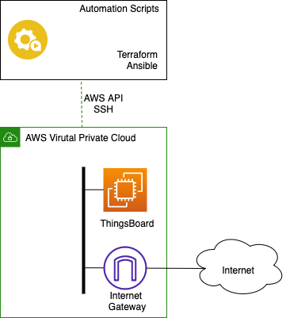

# Ansible Lab

## Objectives

- get familiar with Ansible key technical concepts and technologies
- translate a bash script to Ansible playbook automation
- experiment with Ansible-Playbook syntax
- automate prerequisites to a ThingsBoard project

---

## Prerequisite

The ansible lab activity will be conducted on the same VM you were using for Terraform.

Ansible will configure a VM in your AWS VPC. You need an EC2 instance of minimal size t2.medium, t2.large is recommended with Internet access as shown on the diagram bellow.

<p align="center">
  
</p>

---

## Ansible Overview

Ansible works by connecting to what you want automated and pushing programs that execute instructions that would have been done manually.
These programs utilize Ansible modules that are written based on the specific expectations of the endpoint’s connectivity, interface, and commands. Ansible then executes these modules (over standard SSH by default), and removes them when finished (if applicable).
There are no additional servers, daemons, or databases required.

We differentiate the central node where ansible is running : `control node` from the node you are configuring the `managed hosts`

### Control node

Unlike other configuration management utilities, ansible uses an agentless architecture (or 'temporary agent'). Ansible itself only needs to be installed on the host it will run referred as the `control node`.

Ansible installation on the control node requires Python 3.8 or newer installed.
Ansible is packaged as a python library.

### Managed hosts

Although you do not need a daemon on your managed nodes, you do need a way for Ansible to communicate with them. For most managed nodes, Ansible makes a connection over SSH and transfers modules using SFTP.
If possible it's advisable for the managed host to run Python 3.5+.

### Ansible project folder structure

Simplified standalone folder structure that can be easily refactored and enhanced to accommodate Ansible packaging into roles or collections.

```console
my-ansible-projct/          # This hierarchy represents an Ansible poject
    tasks/                  # 
        gin-tasks.yml       # Generic tasks for playbooks
        tonic-tasks.yml      
    templates/              #  Files for use with the template resource
        gin-tonic.conf.j2   #  Templates end with .j2
    files/                  #
        gin.txt             #  Files for use with the copy resource
        tonic.sh            #  Script files for use with the script resource
    vars/              
        a-var-file.yml      #  Variables file for playbooks
    library/                # folder for custom modules
        gin-tonic/...
    gin.yml                 # A playbook
    tonic.yml               # Another playbook
    inventory.ini           # Inventory file 
```

Note: This structure will be referenced later on as the `ansible-project folder`.

### Ansible installation and ansible-project creation

Objective: Install Ansible and create a blank ansible project.

1. Installation

  Verify python version and install Ansible:

  ```bash
  ubuntu@vm1:~$ python3 --version
  ```

  Expected output

  ```console
  Python 3.8.10
  ```

  ```bash
  pip3 install ansible ansible-runner paramiko
  ```

  Verify ansible installation

  ```bash
  ubuntu@vm1:~$ ansible --version
  ```

  Expected output

  ```console
  ansible [core 2.12.6]
    config file = None
    configured module search path = ['/home/ubuntu/.ansible/plugins/modules', '/usr/share/ansible/plugins/modules']
    ansible python module location = /home/ubuntu/.local/lib/python3.8/site-packages/ansible
    ansible collection location = /home/ubuntu/.ansible/collections:/usr/share/ansible/collections
    executable location = /home/ubuntu/.local/bin/ansible
    python version = 3.8.10 (default, Mar 15 2022, 12:22:08) [GCC 9.4.0]
    jinja version = 3.1.2
    libyaml = True
  ```

2. Ansible Project

Take the time to reproduce the base ansible-project structure proposed, with empty folders and no files. 

## Inventory

A host inventory defines which hosts Ansible manages. Hosts may belong to groups which are typically used to identify the hosts' role in the datacenter. A host can be a member of more than one group.

There are two ways in which host inventories can be defined. A static host inventory may be defined by a text file or a dynamic host inventory may be be generated from outside providers.

### Static host inventory

An ansible static host inventory is define in an ini-like text file or in YAML format.
In INI format, each section defines one group of hosts (a host group). Each section starts with a host group name enclosed in square brackets (`[]`). 
Then host entries for each managed host in the group are listed, one host per line.

A valid host entry follow the following syntax:
```
[<alias>] (<IP> | <Hostname>) [<parameter>=<value>...]
```

Example of an ansible inventory file in `my-ansible-project/inventory-dev.ini`:
```ini
[webservers]
localhost  ansible_connection=local
web1 ansible_host=198.18.150.48
web2 ansible_host=198.18.150.58
web3.gintonictelecom.net

[dbservers]
web1
web3
```

This inventory defines 
- Four `webservers` :
  - localhost : is the host ansible is running on hence the `ansible_connection` type is set to `local`
  - web1/web2 : are name alias to a VM with IP address 198.18.150.48 and 198.18.150.58 respectively
  - web3.gintonictelecom.net : is a DNS name to a web server
- 2 `dbservers` :
  - web1 and web2 defined previously.

The command line `ansible-inventory` verifies your inventory and display in different format. 
```
ansible-inventory -i my_inventory.ini --list 
```
Command output:
```json
{
    "_meta": {
        "hostvars": {
            "localhost": {
                "ansible_connection": "local"
            },
            "web1": {
                "ansible_host": "198.18.150.48"
            },
            "web2": {
                "ansible_host": "198.18.150.58"
            }
        }
    },
    "all": {
        "children": [
            "dbservers",
            "ungrouped",
            "webservers"
        ]
    },
    "dbservers": {
        "hosts": [
            "web1",
            "web3"
        ]
    },
    "webservers": {
        "hosts": [
            "localhost",
            "web1",
            "web2",
            "web3.gintonictelecom.net"
        ]
    }
}
```

### Dynamic host inventory

Ansible host inventory information can also be dynamically generated. Source for dynamic inventory information include public/private cloud providers like AWS GCP Openstack or configuration management databases (CMDB).

A dynamic host inventory plugin is nothing but a python script that returns an Ansible formatted inventory structure.

Note: it's a good practice to use SSH key-pair authentication from Control Node to Managed Hosts. And to enable passwordless sudo for the user ansible is using to connect to the Managed host.

### Activity : static inventory

Objective : Create a static inventory file to connect to your ThingsBoard VM

3. Inside your `ansible-project` folder create a `inventory.ini` file to connect to the ThingsBoard VM.

The full list of Ansible inventory parameters is [available on Ansible documentation.](https://docs.ansible.com/ansible/latest/user_guide/intro_inventory.html#connecting-to-hosts-behavioral-inventory-parameters)

We foresee usage of `ansible_host`, `ansible_ssh_private_key_file` and `ansible_user` host/group parameter.

4. You can validate your inventory by asking ansible to connect to `all` the managed hosts defined.
```bash
ansible all -i inventory.ini --module-name ping
```

Expected output
```
thingsboard | SUCCESS => {
    "ansible_facts": {
        "discovered_interpreter_python": "/usr/bin/python3"
    },
    "changed": false,
    "ping": "pong"
}
```

--- 

## YAML 
Ansible playbooks are written using the YAML (Yet Another Markup Language) language. Therefore it's necessary to understand the basics of YAML syntax to compose Ansible playbook.

YAML was designed primarily for the representation of data structure such as lists and associative arrays in an essay to write, human-readable format. 
This design objective is accomplished primarily by abandoning traditional enclose syntax, such as brackets, braces (JSON) or opening and closing tags (XML). Instead YAML datat hierarchy structures are maintained using outline indentation.
There is no strict requirement regarding the number of space characters used for indentation other than elements must be further indented than their parents to indicate nested relationships.

Note : Indentation can only be performed using space character (no TAB). Indentation is very critical to the proper interpretation of YAML.
**It's highly recommended to use an IDE (You will suffer)**. Users of VIM can alter the TAB key when editing Yaml files to perform 2 spaces instead. 
```
autocmd FileType yaml setlocal ai ts=2 sw=2 et
```

### Strings

string in YAML do not require enclosure in quotations. If desired, strings can enclosed in either double-quotes or single-quotes.

```yaml
description: a valid string
```
```yaml
description: 'a valid string'
```
```yaml
description: "a valid string"
```

### List
```yaml
webservers:
  - web1
  - web2
  - web3
```

Python equivalent:
```python
webeservers = ['web1','web2','web3']
```

### Dictionaries
```yaml
lab:
  name: gin-208
  subject: ansible
  date: 2022-05-23
```

Python equivalent:
```python
lab = { 
  'name' : 'gin-208',
  'subject' : 'ansible',
  'date' : '2022-05-23'
}
```

## Modules and Playbook

Modules are programs that Ansible uses to perform operations on managed hosts. They are ready-to-use tools designed to perform specific operations.

There are three types of Ansible modules:

1. Core modules : Ansible built-in modules shipped with ansible an maintained by the Ansible team
2. Galaxy Modules : Modules created/maintained by the community or the industry. They are distributed via 'ansible packet manager' ansible-galaxy. Each ansible release often promote to core most used community modules.
3. Custom Modules : Your own modules.

Ansible automation strategy is to converge to the target intent configuration state. Some tasks might be expected to fail during your initial deployment. You should be able to re-run the all tasks until configuration state is reached. 
In that consideration and because Ansible is stateless, modules *must* be idempotent. Each module *should* implement a logic to test if they need to be executed or not, modules must have a reliable predictive and consistent output. This is the main limitation of running Ansible in production. When using custom/community modules extensive testing of your automation plays must be done to prevent side effects on your infrastructure.

* [All ansible modules list available here](https://docs.ansible.com/ansible/2.9/modules/list_of_all_modules.html)

### Modules usage

Technically a module is nothing more than a python script that accepts a dictionary as parameter input and output an Ansible formatted dictionary structure.  
A module is invoked in ansible using the following YAML syntax :

```yaml
ansible.builtin.copy:         #module name
  src: /etc/gin.conf          #module parameters
  dest: /etc/tonic.conf     
```
* [Ansible copy module parameters github](https://github.com/ansible/ansible/blob/82f3a57bee274b52db8bbf1d1c072997f9c4f5f2/lib/ansible/modules/copy.py#L531)

When using a module always refer to the [module documentation](https://docs.ansible.com/ansible/latest/collections/ansible/builtin/index.html) and verify its parameters and usage.

Ansible modules can be used to perform operations on managed hosts using [simple ad hoc commands](https://docs.ansible.com/ansible/latest/user_guide/intro_adhoc.html). while useful for simple operations ad hoc commands are not suited for the challenges of complex configuration management and declarative automation.
Automating an infrastructure is the result of several `tasks`, performed by several `modules`, `tasks` are aggregated in a `playbook`. 

### Playbook

A `Playbook` is a set of plays. A play must define a target inventory object (host or group) referred as `hosts` and a set of `tasks` performing that are a set of `modules`.

For example
```yaml
---                                         #Conventionaly YAML file starts with '---'
- name: A simple play                       #Desciptive play name
  hosts: webservers                         #Target managed hosts, tasks will run on/toward. 
  gather_facts: yes                         #Gather `facts` on the target host and store them in `ansible_facts` variable
  
  tasks:                                    #List of tasks for the play
    - name: display facts                   #Name of the task
      ansible.builtin.debug:                #Module with arguments
        var: ansible_facts                  #Display facts content
        
    - name: Print a message for debug       
      ansible.builtin.debug:                
        msg: "This is a test"
      
    - name: copy local file to webserver
      ansible.builtin.copy:
        src: local-gin.conf
        dest: /etc/tonic.conf
```

Note: The ordering of the content within a playbook is important, tasks are evaluated top to bottom.

### Activity : Playbook

Objective : Create a playbook to install docker and docker-compose on the managed host.

5. Write an ansible playbook to automate the following Ubuntu shell commands.
```bash
#Install docker
sudo apt update
sudo apt install docker.io

#Download and install docker compose
sudo curl -L "https://github.com/docker/compose/releases/download/v2.5.1/docker-compose-linux-x86_64" -o /usr/local/bin/docker-compose
sudo chmod +x /usr/local/bin/docker-compose
```

By default Ansible connect as the user defined in inventory/control node, for privilege escalation for a given task you can use the parameter `become: true` :
```yaml
- name: copy file to webserver to a restricted path
  ansible.builtin.copy:
    src: local-gin.conf
    dest: /etc/tonic.conf
  become: true
```

We foresee usage of modules `ansible.builtin.apt`, `ansible.builtin.get_url`.

6. Execution of a playbook is done with the following command :
```
ansible-playbook -i inventory.ini <playbook-name>.yml
```

Note: 
  * Always write your playbook with idempotency in mind (as much as you can of course...).
  * The command line parameter`-vvv` - very very verbose - can help with the troubleshooting.

---

## Variables

Ansible supports variables that can be used to store values that can reused throughout files in an entire Ansible project. Variables provide a convenient way to manage dynamic values for a given environment in your Ansible project.

To correctly interact with Ansible, you need to apprehend Ansible variable scope and precedence system.

### Scope

Variables in Ansible can be defined in a bewildering variety of places. However this can be simplified to three basic scope levels:

* Global scope : Variables set from the command line or Ansible Configuration
* Play scope: Variables set in a play and related structure
* Host scope: Variables set on host groups and individual hosts by the inventory, fact gathering or tasks.

### Precedence

At execution, your playbook will have access to the variables coming from the different scopes.
If the same variable name is defined at more than one level, the higher wins.

At high level, here is the order of precedence from least to greatest  :
 
1. inventory vars
2. playbook vars 
3. command line vars

For reference, the full detailed precedence rules are [available on ansible documentation](https://docs.ansible.com/ansible/latest/user_guide/playbooks_variables.html#understanding-variable-precedence) 

### Defining variables

Playbook variables can be defined in multiple ways. One of the simplest is to place it in a `vars` block at the beginning of a playbook:

```yaml
---
- hosts: all
  vars:
    user: gin
    home: /home/tonic
```

If you meant to reuse same group of variables in different plays, it's advised to define your variables in a dedicated file inside your project `vars` folder and import the file in the different plays:

Content of `my-ansible-project/vars/users.yml`
```yaml
user: gin
home: /home/tonic
```

Header of any playbook in `my-ansible-project/playbook-gin.yml`:
```yaml
---
- hosts: all
  vars_files:
    - vars/user.yaml
```

### Using variables in playbooks

Variables are referenced by placing the variable name in double curly braces.

```yaml
- hosts: all
  vars:
    user: gin
    home: /home/tonic
  
  tasks:
    - name: Print a message for debug       
    ansible.builtin.debug:                
      msg: "Configuration for user : {{ user }} in directory :{{ home }}"
```

Note: 
  * Although Ansible is lenient, make sure variables are in a double quote string, it will prevent errors later on. `{{ a_var }}` should be written `"{{ a_var }}"`.
  * You can have several variables in the same string.

### Host and group variables

It's possible to apply variables directly to host or globally to a group in the inventory file.

Content of `my-ansible-project/inventory.ini`
```ini
[webservers]
localhost  ansible_connection=local
web1 ansible_host=198.18.150.48
web2 ansible_host=198.18.150.58
web3.gintonictelecom.net

[dbservers]
web1
web3

[dbservers:vars]
ansible_user=gin
lab_name=my-ansible-lab
```

- `ansible_connection` is a ansible reserved variable name attached to the host `localhost`.
- `[dbservers:vars]` define a `var` block for the group `dbservers`.

### Activity : variables

Objective : Add variables to your playbook

7. The package to be installed should now be a variable.

---

## Jinja2 templates

Ansible uses the pythonic Jinja2 templating system to modify files before they are distributed to the managed hosts. 

Note: Jinja2 is the key templating engine of [Django](https://www.djangoproject.com) to render HTML pages.

### Delimiters

A jinja template is a text file with variables or logic expressions placed between tags or delimiters.
At execution Jinja2 engine parses the text file for variables and renders it.

Variables are enclosed in double curly braces `{{ VAR }}`, much like variables in Ansible playbooks. While logic expressions are enclosed in ``.

### Loops
With variable :
```python
users = [
    'gin' : {
       'home' : '/home/gin',
    },
    'tonic':{
      'home' : '/home/tonic',
    }   
]
``` 

Content of jinja template file :
```jinja
The following users will be created :

User {{ user }} with home folder : {{ user['home'] }}

```

Will be rendered as :
```console
The following users will be created :

User gin with home folder : /home/gin
User tonic with home folder : /home/tonic
```

### Conditionals

With variable :
```python
users = [
    'gin' : {
        'home' : '/home/gin',
        'superuser' : True
    },
    'tonic':{
      'home' : '/home/tonic',
      'superuser' : False
    }   
] 
```

Content of jinja template file :
```jinja
Only super users will be created :

  
User {{ user }} with home folder :{{ user['home'] }}
  

```

Will be rendered as :
```console
Only super users will be created :

User gin with home folder : /home/gin
```

### Usage in playbooks

Several modules accept a Jinja2 template as a module parameter. The most used module to render template is `ansible.builtin.template`.
```yaml
- name: Template a file to /etc/gin.conf
  ansible.builtin.template:
    src: templates/gin.conf.j2
    dest: /etc/gin.conf
```

[Full ansible builtin module template documentation](https://docs.ansible.com/ansible/latest/collections/ansible/builtin/template_module.html)

### Activity : Jinja2

Objective: Create a dynamic docker-compose template.

8. Update your ansible project to add the rendering of a docker-compose file.

  You should create your Jinja template files in `my-ansible-project/templates/` folder.

  Modify your ansible playbook to add the following ubuntu shell commands automation steps :
  ```bash
  mkdir /home/ubuntu/thingsboard
  cd /home/ubuntu/thingsboard
  mkdir -p mytb-data && sudo chown -R 799:799 mytb-data
  mkdir -p mytb-logs && sudo chown -R 799:799 mytb-logs

  #Create a docker-compose.yaml file with the content until EOF
  cat << EOF > docker-compose.yaml
  version: '2.2'
  services:
    mytb:
      restart: always
      image: "thingsboard/tb-postgres"
      ports:
        - "8080:9090"
        - "1883:1883"
        - "7070:7070"
        - "5683-5688:5683-5688/udp"
      environment:
        TB_QUEUE_TYPE: in-memory
      volumes:
        - ./mytb-data:/data
        - ./mytb-logs:/var/log/thingsboard 
  EOF
  ```
  
  The ports ThingsBoard is listening on must be template variables. 
  - 8080:9090 : Web UI HTTP Port
  - 1883:1883 : MQTT broker Port
  - 7070:7070 : Edge RPC port
  - 5683-5688:5683-5688/udp : LwM2M ports

  Push the rendered template file to the project folder on the managed host.

  We foresee usage of `ansible.builtin.template` and `ansible.builtin.file`.

9. Once the docker compose file is present on the ThingsBoard VM deploy the containers with the command :

  ```bash
  cd /home/ubuntu/thingsboard
  docker-compose up -d
  ```

  Open a browser to `<VM IP>:8080/login` and verify that you can connect to ThingsBoard.

10. Using terraform or AWS web console adjust your VM security groups to allow access to the allocated ports.

---
