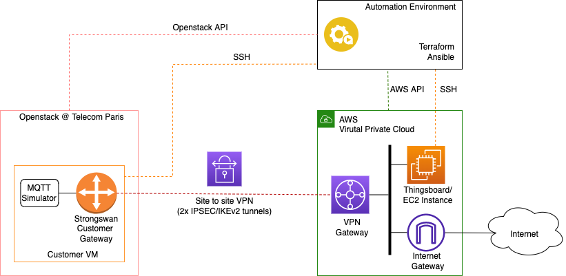
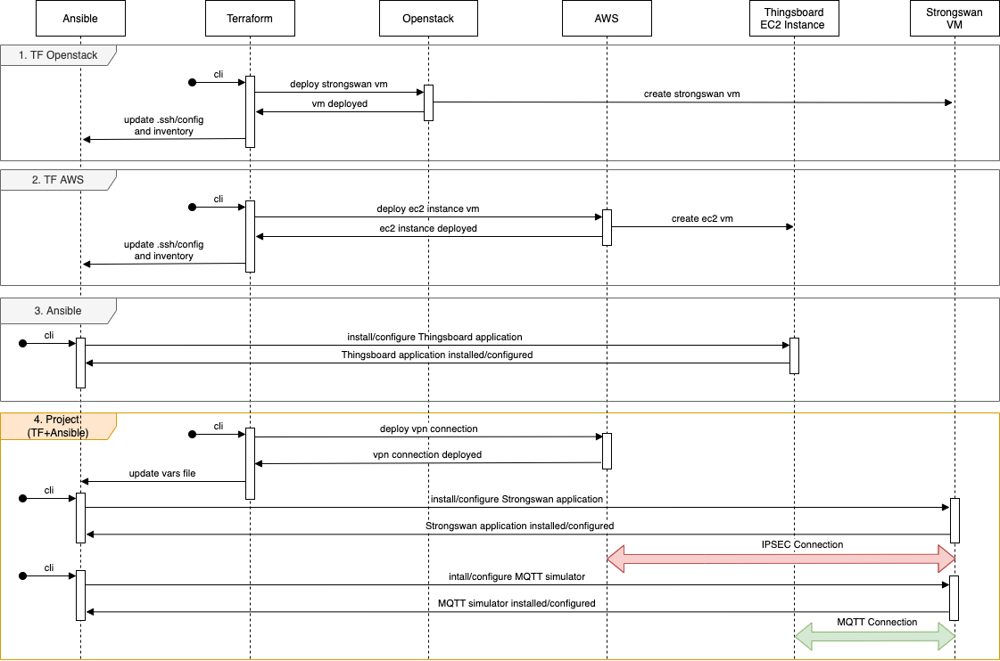

# AWS VPN Automation project

## Objectives

The project aims to develop an automation environment to deploy a VPN service between an AWS Virtual Private Cloud and 'on-prem' (on premise)resources deployed on a private cloud at Telecom Paris. 
<!--- (JLR: thy don't know what it is yet, so better to deal with that latter on) In the AWS VPC the customer gateway, VPN gateway, VPN connections and route table constructs have to be deployed and configured to interwork with a localy deployed virtual machine on Telecom Paris openstack cluster. -->
First, you will install a VPN gateway (and associated constructs) in your *AWS VPC*. A VM has been deployed for your group in the data center of the Network & Computer Science Department of Telecom Paris. It will be referred as the *Customer vm* in the following. You will deploy and configure the [Strongswan application](https://www.strongswan.org) (which provides support for IPSEC and IKEv2) on this virual machine, in order to connect securely to your *AWS VPC*. Finally you will test that you can deploy an end to end IOT/MQTT communication between a simulated sensor sitting on the cgw machine on premise (at Telecom Paris) and the Thingsboard application deployed in AWS.

---

## VPN architecture

The diagram below highlights the target architecture which needs to be deployed and configured (through an automated process):



On the AWS side, theses objects are already in place (from the previous labs): a vpc, a route table with associated subnet and an EC2 instance with associated security group. The followings new objects will have to be deployed:

- *aws_vpn_gateway*, the VPN gateway on the AWS side (which will be associated with your AWS vpc).
- *aws_customer_gateway*, which represents your customer VM running Strongswan (for which you need the public IP address).
- *aws_vpn_connection*, setting-up an end-to-end IPSec tunnel between the AWS VPN gateway and your customer gateway.
- *aws_vpn_connection_route*, used to associate static routes to the tunnels, on the AWS side.
- aws_vpn_gateway_route_propagation, used  to propagate routes from your VPN to the routing table of your VPC.

Don't hesitate to refer to the AWS and/or associated terraform documentation for more information on these objects.

On the customer site (i.e. Telecom Paris premises), a virtual machine has set-up for your group. Its IP addresses (private and public) and credentials already exists are available on moodle. You will be to install the Strongswan application and to configure this machine, accordingly to the given parameters from your AWS vpn gateway:

- for Strongswan:
  - ipsec.conf
  - ipsec.secrets
- for Linux:
  - ip link, ip addr and ip route for both tunnels with a mtu lower or equal than 1419
  - ip tables
  - ipv4 network system

Some indications are provided in the following sections in order to help you.

---

## Automation steps

The different steps we foresse for the automation process are highlighted below:



We can split the overall sequence diagram as follow:

1. TF Openstack: the procedure includes the deployment of the local cloud virtual machine on Telecom Paris Openstack cluster. *It has already done for you and we will communicate both the IP address and the credentials for the VM*
2. TF AWS: the procedure includes the deployment of an EC2 instance. *It has been already done in a previous session during the Terraform lab.*
3. Ansible: the procedure includes the installation/configuration of the Thingsboard application on the above mentioned EC2 instance. *It has been already done in a previous session during the Ansible lab.*
4. Project: these final procedures are responsible for vpn configuration between Strongswan and AWS, *and need to be developed during this project*.

---

## Project guidelines

We foresee the following steps for the VPN automation:

1. use Terraform to deploy the necessary AWS constructs in order to the handle VPN connections (please refer to the VPN architecture section). In order to retrieve the necessary information to proceed further (e.g. in step 2), you can store the relevant information generated at this step in a local file, using a resource of type "local_file", as follows:

```console
resource "local_file" "ansible_vars" {
  content = <<-DOC
    # Ansible vars_file containing variable values from Terraform.
    # Generated by Terraform mgmt configuration.

    strongswan_base: /etc
    ipsec_service: strongswan
    vpc_cidr: ${data.aws_vpc.this.cidr_block}
    local_cidr: ${var.vpn_connection_destination}
    tunnel1_address: ${aws_vpn_connection.this.tunnel1_address}
    tunnel1_cgw_inside_address: ${aws_vpn_connection.this.tunnel1_cgw_inside_address}/30
    tunnel1_vgw_inside_address: ${aws_vpn_connection.this.tunnel1_vgw_inside_address}/30
    tunnel1_preshared_key: ${aws_vpn_connection.this.tunnel1_preshared_key}
    tunnel2_address: ${aws_vpn_connection.this.tunnel2_address}
    tunnel2_cgw_inside_address: ${aws_vpn_connection.this.tunnel2_cgw_inside_address}/30
    tunnel2_vgw_inside_address: ${aws_vpn_connection.this.tunnel2_vgw_inside_address}/30
    tunnel2_preshared_key: ${aws_vpn_connection.this.tunnel2_preshared_key}
    DOC
  filename = var.ansible_vars_file
}
```

  *Remark*: You may also use a terraform *template* ressource instead, if you prefer.

2. use Ansible to install and configure the Strongswan application. You'll need the Customer VM details (IP and credentials) --- contact your professors if you don't have them. Please refer to [AWS configuration](https://docs.aws.amazon.com/vpn/latest/s2svpn/SetUpVPNConnections.html#vpn-download-config) from step 1, in order to build the Ansible scripts and templates. 
  You'll need in particulaat to create Strongswan ipsec.conf and ipsec.secret files through ansible templates. You'll also use ansible to build a bash script, as in the following example: 

```console
# Tasks to install and configure strongSwan
# Tunnel 1
if [ -d "/sys/class/net/Tunnel1" ]; then
    sudo ip link set Tunnel1 type vti local {{ansible_host}} remote {{ tunnel1_address }} key 100
    sudo ip addr change {{ tunnel1_cgw_inside_address }} remote {{ tunnel1_vgw_inside_address }} dev Tunnel1
    sudo ip route change {{ vpc_cidr }} dev Tunnel1 metric 100
else
    sudo ip link add Tunnel1 type vti local {{ansible_host}} remote {{ tunnel1_address }} key 100
    sudo ip addr add {{ tunnel1_cgw_inside_address }} remote {{ tunnel1_vgw_inside_address }} dev Tunnel1
    sudo ip route add {{ vpc_cidr }} dev Tunnel1 metric 100
fi
sudo ip link set Tunnel1 up mtu 1419
#Tunnel 2
if [ -d "/sys/class/net/Tunnel2" ]; then
    sudo ip link set Tunnel2 type vti local {{ansible_host}} remote {{ tunnel2_address }} key 200
    sudo ip addr change {{ tunnel2_cgw_inside_address }} remote {{ tunnel2_vgw_inside_address }} dev Tunnel2
    sudo ip route change {{ vpc_cidr }} dev Tunnel2 metric 100
else
    sudo ip link add Tunnel2 type vti local {{ ansible_host}} remote {{ tunnel2_address }} key 200
    sudo ip addr add {{ tunnel2_cgw_inside_address }} remote {{ tunnel2_vgw_inside_address }} dev Tunnel2
    sudo ip route add {{ vpc_cidr }} dev Tunnel2 metric 200
fi
sudo ip link set Tunnel2 up mtu 1419
# IP Tables
sudo iptables -t mangle -A FORWARD -o Tunnel1 -p tcp --tcp-flags SYN,RST SYN -j TCPMSS --clamp-mss-to-pmtu
sudo iptables -t mangle -A FORWARD -o Tunnel2 -p tcp --tcp-flags SYN,RST SYN -j TCPMSS --clamp-mss-to-pmtu
sudo iptables -t mangle -A INPUT -p esp -s {{ tunnel1_address }} -d {{ansible_host}} -j MARK --set-xmark 100
sudo iptables -t mangle -A INPUT -p esp -s {{ tunnel2_address }} -d {{ansible_host}} -j MARK --set-xmark 200
# Strongswan/Charon
sudo sed -i "s/# install_routes = yes/install_routes = no/g" /etc/strongswan.d/charon.conf
# Linux Sysctl
sudo sysctl -w net.ipv4.ip_forward=1
sudo sysctl -w net.ipv4.conf.Tunnel1.rp_filter=2
sudo sysctl -w net.ipv4.conf.Tunnel1.disable_policy=1
sudo sysctl -w net.ipv4.conf.Tunne2.rp_filter=2
sudo sysctl -w net.ipv4.conf.Tunnel2.disable_policy=1
sudo sysctl -w net.ipv4.conf.{{ main_interface }}.disable_xfrm=1
sudo sysctl -w net.ipv4.conf.{{ main_interface }}.disable_policy=1
sudo sysctl -p
# Restart Strongswan
sudo ipsec restart
```

This bash script will have to be uploaded and excuted on the customer vm, with ansible. 

3. Test your VPN connection: both on AWS and Strongswan sides check the tunnels and IPSEC/IKEv2 associations status. Check also that ping is ok between Strongswan VM and Thingsboard EC2 instance.

4. Use ansible to deploy and configure your MQTT simulator (for example a python script generating an random number). Your code can be based on the many examples which exist on the web (as long as you cite your sources). 

5. Test your end to end MQTT connectivity by checking you can retrieve data from your MQTT simulator in Thingsboard.

---
