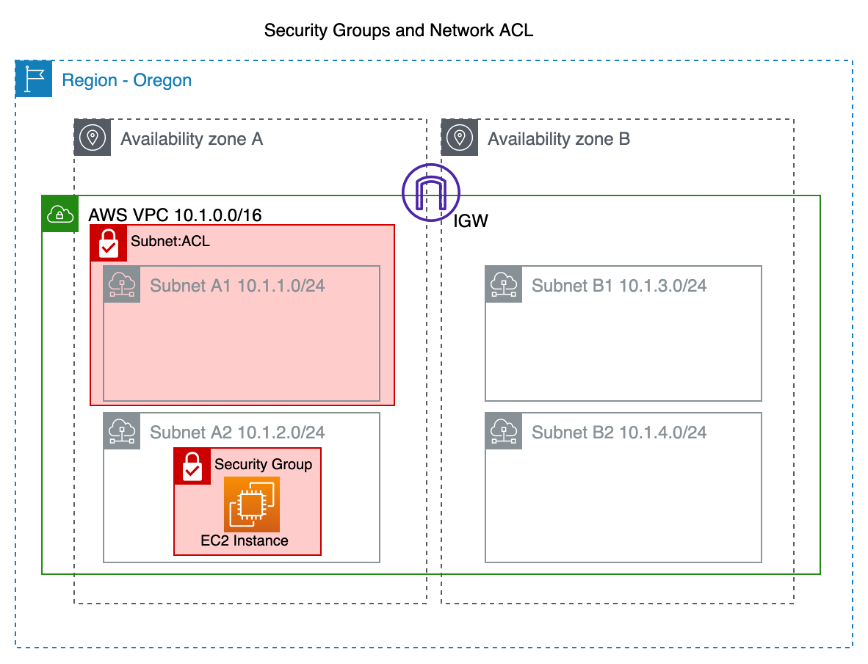

# AWS Overview

Amazon Web Services (AWS) is a comprehensive and widely used cloud computing platform offered by Amazon. It provides a vast array of services that enable businesses and individuals to build and deploy various types of applications, manage data, and scale infrastructure without the need for upfront investments in hardware or extensive setup.

## Insight 1. AWS Cloud Architecture

AWS operates through a global network of data centers, called Availability Zones (AZs), located in different regions around the world. Each AZ consists of one or more data centers, and these AZs are isolated from each other to provide fault tolerance and high availability.

Regions:

Availability Zone:

## Insight 2. Key Concepts and Services

**Compute Services**

- Amazon EC2 (Elastic Compute Cloud): Provides resizable compute capacity in the cloud, allowing you to run virtual servers (instances) on-demand.
- AWS Lambda: Enables serverless computing by allowing you to run code in response to events without provisioning or managing servers.

**Storage Services**

- Amazon S3 (Simple Storage Service): Offers scalable object storage for data backup, archiving, and web hosting.
- Amazon EBS (Elastic Block Store): Provides persistent block storage for EC2 instances.
- Amazon Glacier: Designed for long-term storage of data archives at a low cost.

**Database Services**

- Amazon RDS (Relational Database Service): Managed relational databases supporting various engines like MySQL, PostgreSQL, Oracle, etc.
- Amazon DynamoDB: Fully managed NoSQL database service for applications that need seamless and quick scaling.

**Networking Services**

- Amazon VPC (Virtual Private Cloud): Lets you create isolated networks within the AWS cloud.
- Amazon Route 53: Provides domain name system (DNS) web service and domain registration.
- AWS Direct Connect: Establishes a dedicated network connection between on-premises infrastructure and AWS.

**Security and Identity**

- AWS Identity and Access Management (IAM): Manages user identities and permissions within AWS.
- Amazon Cognito: Provides identity management for web and mobile applications.
- AWS Key Management Service (KMS): Enables you to create and control the encryption keys used to secure your data.

**Management and Monitoring**

- AWS Management Console: Provides secure login using your AWS or IAM account credentials.
- AWS CLI: Controls multiple AWS services from the command line and automate them through scripts.
- AWS SDK: Enables access to AWS services using most development languages as part of an application.
- AWS CloudFormation: Automates the provisioning and management of AWS resources using templates.
- Amazon CloudWatch: Monitors resources and applications, providing metrics and alerts.
- AWS Systems Manager: Helps you manage and automate operational tasks across your AWS infrastructure.

**Developer Tools**

- AWS CodePipeline, AWS CodeBuild, and AWS CodeDeploy: Enable continuous integration, continuous delivery, and deployment of applications.

 **AI and Machine Learning**

- Amazon SageMaker: Provides tools for building, training, and deploying machine learning models.
- Amazon Rekognition: Offers image and video analysis using deep learning.

**Analytics**

- Amazon Redshift: Data warehousing service for running complex queries on large datasets.
- Amazon EMR (Elastic MapReduce): Provides a managed Hadoop framework for big data processing.

**Content Delivery and CDN**

- Amazon CloudFront: Content delivery network service for securely delivering data, videos, applications, and APIs.

These are just a subset of the extensive services AWS offers. Businesses can leverage these services to create scalable, reliable, and cost-effective solutions tailored to their specific needs. AWS also provides tools for monitoring usage, controlling costs, and ensuring security.

## Insight 3. Shared Responsibility Model

The AWS Shared Responsibility Model is a framework that outlines the division of security and compliance responsibilities between Amazon Web Services (AWS) and its customers. It helps clarify which security aspects are managed by AWS and which aspects are the responsibility of the customer. This model is crucial for ensuring a secure and compliant environment in the cloud.

The model is generally divided into two main categories:

 **AWS Responsibility**

AWS is responsible for the security "of" the cloud infrastructure. This includes the underlying physical data centers, networking, hardware, and foundational services that AWS provides. AWS takes measures to ensure that its infrastructure is resilient, redundant, and protected against common threats. This includes aspects like:

- Physical security of data centers and infrastructure
- Network architecture and protection
- Hardware maintenance and management
- Availability of services
- Patching and updating of infrastructure components

 **Customer Responsibility**

Customers are responsible for the security "in" the cloud. This means that customers are responsible for securing the data, applications, and configurations they deploy on AWS services. This includes aspects like:

- Data protection and encryption
- Identity and access management (IAM)
- Configuration and management of virtual machines and containers
- Security groups and firewall rules
- Application-level security and code
- Compliance with regulations and industry standards

In summary, while AWS ensures the security and reliability of its infrastructure, customers are responsible for securing the applications, data, and workloads they run on AWS services. The Shared Responsibility Model emphasizes collaboration between AWS and its customers to create a secure and compliant cloud environment. By understanding and following this model, customers can take appropriate measures to implement security best practices and protect their assets in the cloud.

## Insight 4. VPC and Networking

Amazon Virtual Private Cloud (Amazon VPC) is a networking service provided by Amazon Web Services (AWS) that allows you to create and manage a logically isolated section of the AWS Cloud where you can launch AWS resources in a virtual network environment. This virtual network closely resembles a traditional network that you might operate in your own data center, but with the benefits of cloud scalability and flexibility.

VPC, Subnet and Security Group:

VPC, Internet and VPN Gateways:

Key features and components of AWS VPC include:

- **Isolation and Control**: With VPC, you can define your own virtual network topology, including IP address ranges, subnets, and route tables. This enables you to isolate your resources and control the network traffic flow within your VPC.

- **Subnets**: VPC allows you to divide your virtual network into subnets, which are smaller segments of the VPC's IP address range. Subnets can be public (accessible from the internet) or private (not accessible from the internet). You can use these subnets to deploy different types of resources based on their security and accessibility requirements.

- **Security Groups and Network Access Control Lists (NACLs)**: Security Groups and NACLs are used to control inbound and outbound traffic to and from your AWS resources. Security Groups are associated with individual resources and operate at the instance level, while NACLs are associated with subnets and operate at the subnet level.

- **Internet Gateway (IGW)**: An Internet Gateway allows resources in your VPC to access the internet and enables inbound traffic from the internet to reach your resources if you configure your subnets to be public.

- **Virtual Private Gateway (VGW)**: A Virtual Private Gateway enables your VPC to establish secure VPN connections to your on-premises network, extending your data center to the AWS Cloud.

- **Peering**: VPC peering allows you to connect two VPCs together, enabling resources in different VPCs to communicate with each other as if they were on the same network.

- **VPN Connections**: VPC supports creating encrypted VPN connections to securely connect your on-premises data center to your VPC.

- **Direct Connect**: AWS Direct Connect provides dedicated network connections from your on-premises data center to AWS, bypassing the public internet.

- **Elastic IP Addresses**: Elastic IP addresses are static, public IP addresses that you can allocate to your instances, providing a consistent way for your resources to be accessed from the internet.

- **Route Tables**: Route tables define the traffic routes within your VPC. You can associate different route tables with different subnets to control the flow of traffic.

- **Network Address Translation (NAT) Gateways/Instances**: NAT gateways or NAT instances allow instances in private subnets to initiate outbound traffic to the internet while preventing inbound traffic from reaching them.

AWS VPC provides a robust and flexible networking foundation for deploying various types of applications in a secure and isolated manner within the AWS Cloud environment. It allows you to design and configure your network infrastructure according to your specific requirements and best practices.

## Insight 5. AWS Security services

AWS offers a comprehensive set of security services and features to help you protect your data, applications, and infrastructure in the cloud. These services are designed to help you build a secure and compliant environment. Here are some key AWS security services:

- **AWS Organizations**: Organizations enables you to centrally manage and govern multiple AWS accounts, helping you implement security and compliance standards across your organization.

- **AWS Identity and Access Management (IAM)**: IAM enables you to manage access to AWS services and resources securely. You can create and manage users, groups, and roles, and assign permissions to control who can access your resources and what actions they can perform.

- **Amazon VPC (Virtual Private Cloud)**: As described earlier, VPC allows you to isolate and control your network resources in a virtual network environment. You can set up network security groups and access control lists (ACLs) to control inbound and outbound traffic.

- **AWS Web Application Firewall (WAF)**: WAF protects your web applications from common web exploits and attacks by allowing you to define rules that control access to your application and mitigate malicious traffic.

- **Amazon GuardDuty**: GuardDuty is a threat detection service that continuously monitors for malicious activity and unauthorized behavior in your AWS accounts and workloads.

- **Amazon Inspector**: Inspector helps you assess the security and compliance of your applications by automatically analyzing your resources for vulnerabilities and deviations from best practices.

- **AWS Key Management Service (KMS)**: KMS enables you to create and manage encryption keys to protect your data. You can use KMS to encrypt data at rest and data in transit.

- **AWS CloudTrail**: CloudTrail logs and monitors API activity in your AWS account, providing you with a record of actions taken by users, roles, or services. This helps with auditing, compliance, and troubleshooting.

- **Amazon Macie**: Macie uses machine learning to automatically discover, classify, and protect sensitive data in AWS, helping you maintain data privacy and compliance.

- **AWS Shield**: Shield provides protection against Distributed Denial of Service (DDoS) attacks, helping to keep your applications and resources available and accessible.

- **Amazon Inspector**: Inspector assesses the security and compliance of your applications by analyzing your AWS resources for vulnerabilities and deviations from best practices.

- **Amazon Detective**: Detective helps you analyze, investigate, and visualize security data, making it easier to identify potential security issues and understand the root causes.

These are just a few examples of the many security services offered by AWS. Again, it's important to note that security in AWS is a shared responsibility model, where AWS is responsible for the security of the cloud infrastructure, while you are responsible for securing your applications, data, and workloads that you run on AWS. This means that you need to take advantage of these security services and implement best practices to ensure a secure and compliant environment for your applications.