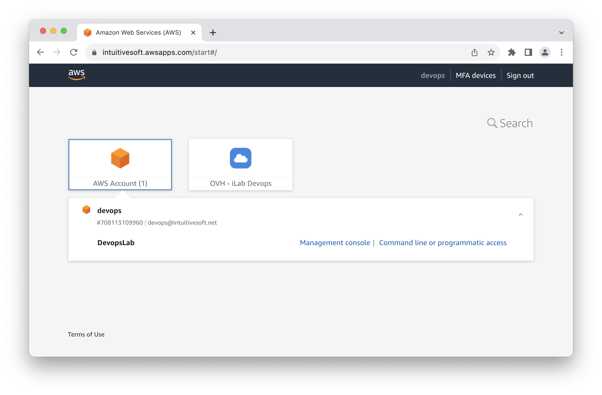
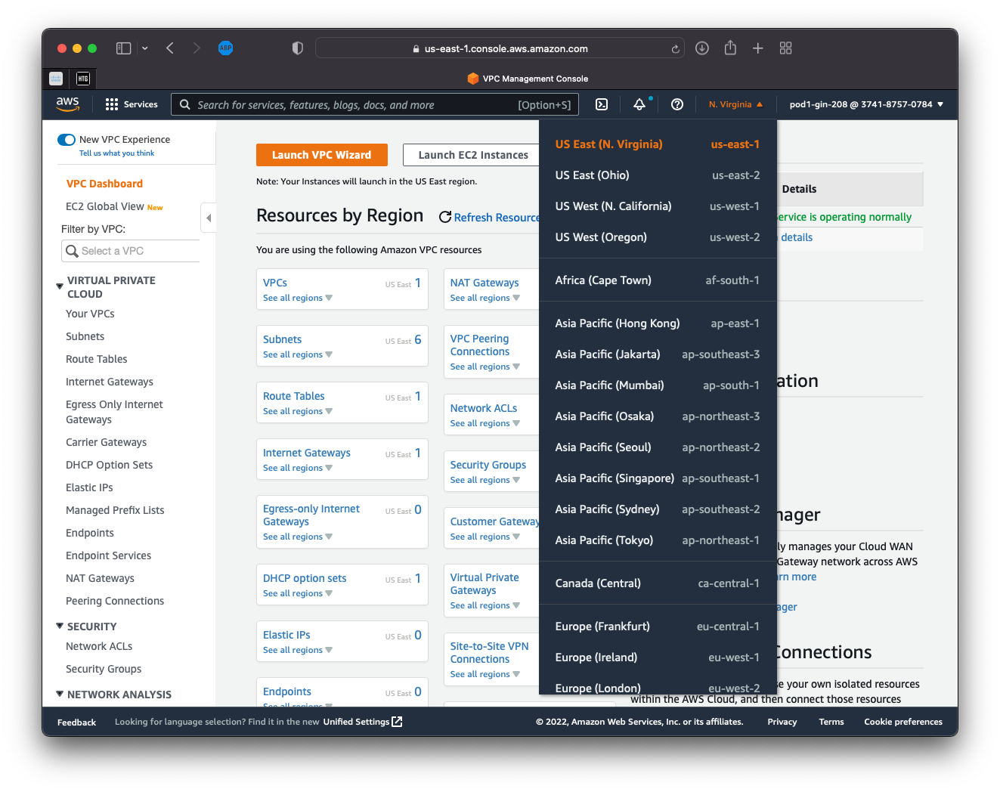
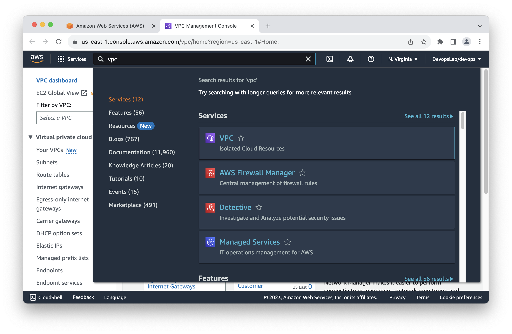
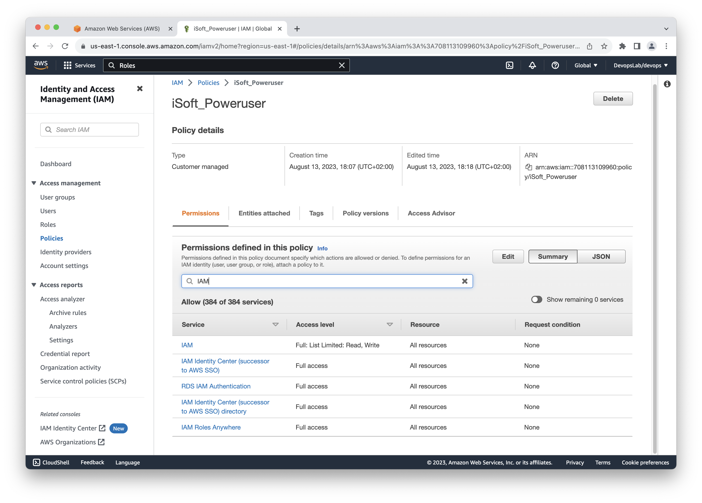
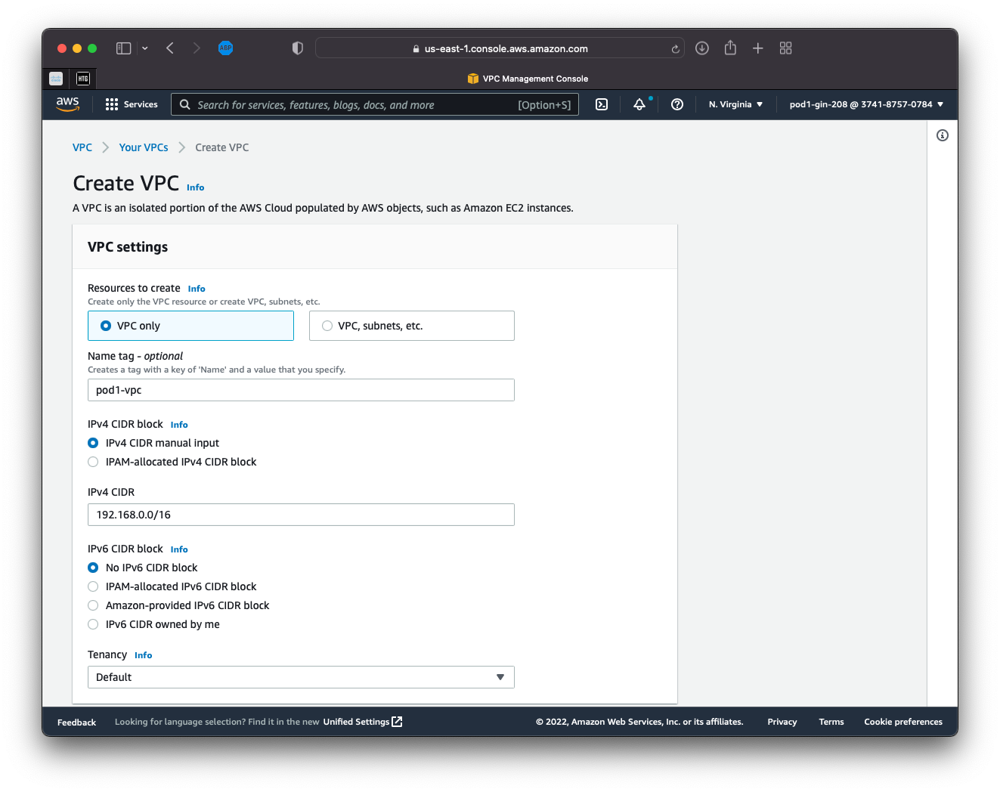
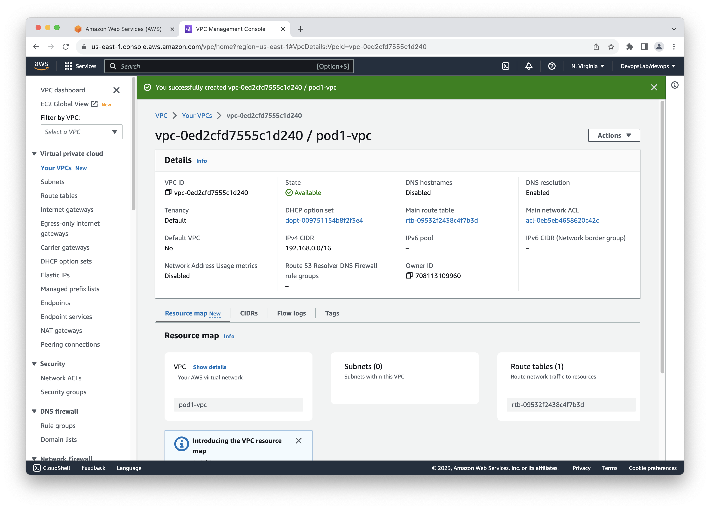
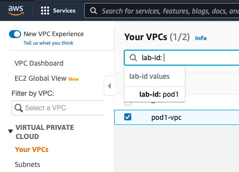
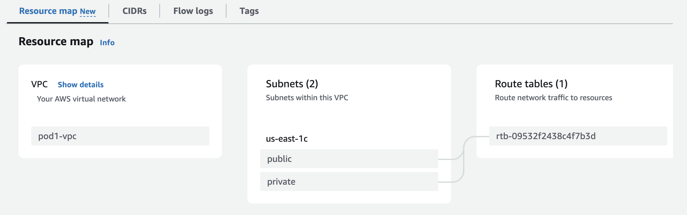
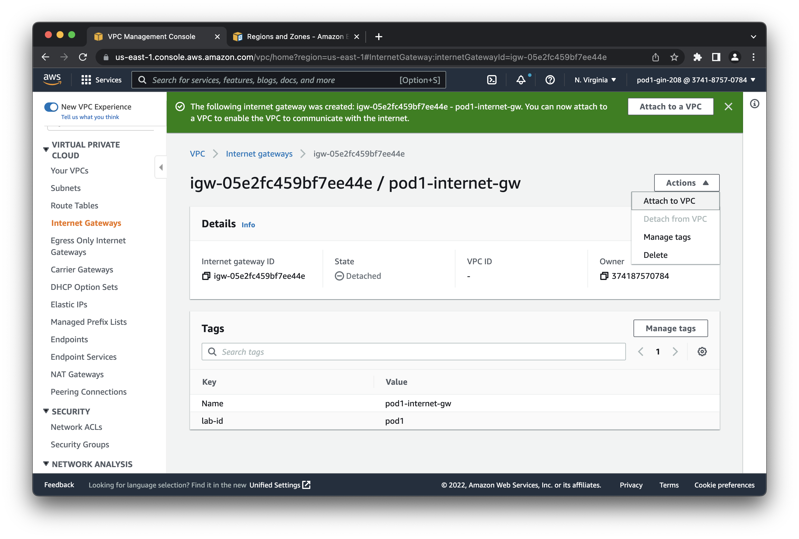
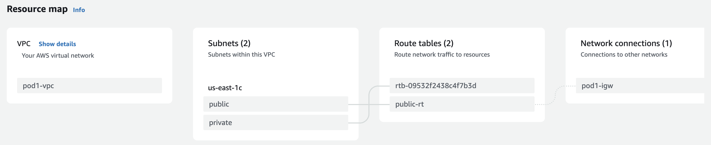

# LAB : AWS Introduction

**Objectives**

- Get familiar with Virtual Private Cloud infrastructures AWS VPC
- Learn VPC key networking constructs
- Create on-demand Virtual Machines with AWS EC2


## Task 0. First Connection

Refer to documentation AWS first connect

## Task 1. Connect to AWS Management console

Connect to the AWS management console using the training SSO portal : 

 [__https://intuitivesoft.awsapps.com/start#/__](https://intuitivesoft.awsapps.com/start#/)

Select your training AWS account and click the link  `Management console` to get access to the account main page.



AWS Cloud infrastructure is segmented in administrative regions
Once connected verify and switch to the lab region : *us-east-1*



The most convenient way to navigate in between AWS services is to use the research bar on the top side and type the name of the service, or feature inside a service, you'd like to access.



## Insight 2. Lab Target


During this lab you will learn how to create the base infrastructure for a virtual data center ready to host your applications.
You will get familiar with AWS main constructs for Cloud Networking, Security and Compute.

**This is a shared lab environment**. During this training you will be instructed to create,edit,delete AWS resources. AWS provides a `tag` system to help you filter through resources with you tag convention. Use it as a best practice to differentiate from other lab environment.  
 
## Insight 3. User Management

AWS Identity and Access Management (IAM) is a web service that helps you securely control access to AWS resources. You use IAM to control who is authenticated (signed in) and authorized (has permissions) to use resources.
IAM policies are defined as a set of permissions that grant Create Read Update Delete (CRUD) operation on any AWS resources. You can then assign policies to an IAM role.
IAM roles are *temporary* identity a `user` or an AWS service can `assume` ( present itself as ) to gain privileges on the resources defined by the role policies.

For example :

The user `John` has the role `admin` that has the `AdministratorAccess` policy attached, it gives full operations to any resource on AWS.
User, `William` has the role `readonly` and `EC2-admin`. It has readonly rights on all AWS resources, he will need to `assume` the role `EC2-admin` if he wants to create an EC2 instance.

Roles are a really handy way to restrain and control user and application access to the strict minimum AWS resources and actions. It's a key component for micro-services and cloud native/serverless application development.

## Task 4. Visualize your user permissions

You user can't modify IAM policies but you can visualize the policy and permissions attached to your user.

**- Task 4.1 -**

Navigate to the `IAM roles` definitions using the web search console or using the following link : [https://us-east-1.console.aws.amazon.com/iamv2/home?region=us-east-1#/roles](https://us-east-1.console.aws.amazon.com/iamv2/home?region=us-east-1#/roles)

**- Task 4.2 -**

Your user is assigned to role `AWSReservedSSO_DevopsLab_XXXXXXXXXXXXXXXX` navigate to the role and visualize the permissions attached to your role. 

**- Task 4.3 -**

You are a PowerUser you have `Full access` to most of AWS resources but some restrictions on some services such as `IAM`. Filter the permissions attached to service `IAM`, you have limited `Read,Write`



## Task 5. AWS Policy 

The graphical interface representation is useful to have an overview. You can switch to the declarative representation of the policy by clicking `JSON`

```json
{
    "Version": "2012-10-17",
    "Statement": [
        {
            "Effect": "Allow",
            "NotAction": [
                "iam:*",
                "organizations:*",
                "account:*"
            ],
            "Resource": "*"
        },
        {
            "Effect": "Allow",
            "Action": [
                "iam:CreateServiceLinkedRole",
                "iam:DeleteServiceLinkedRole",
                "iam:Get*",
                "iam:List*",
                "organizations:DescribeOrganization",
                "account:ListRegions",
                "account:GetAccountInformation"
            ],
            "Resource": "*"
        }
    ]
}
```
An AWS policy is defined by the following arguments : 

**Version**: Specifies the version of the policy language being used.

**Statement**: An array of statements that define the permissions granted by the policy.

**Effect**: "Allow/Deny" right on the API actions specified on the `Action` block.

**Action/NotAction**: Specifies a list of actions that are explicitly not allowed. In this case, it's denying all actions under the "iam", "organizations", and "account" namespaces.

**Resource**: Specify the exact resource on which the policy applies. The asterisk (*) as the resource value indicates that this denial applies to all resources.

## Insight 6. Virtual Private Cloud

Amazon Virtual Private Cloud (Amazon VPC) enables you to launch AWS resources into a virtual network that you've defined. This virtual network closely resembles a traditional network that you'd operate in your own data center, with the benefits of using the scalable infrastructure of AWS. Unless configured otherwise, every VPC is isolated from each other with no resource overlapping and connectivity.

[AWS documentation : Amazon VPC](https://docs.aws.amazon.com/vpc/latest/userguide/what-is-amazon-vpc.html)

In the following activity you will be instructed to create a VPC with the following architecture :


## Task 7. Create your first VPC

**- Task 7.1 -**

Navigate to the `VPC` service using the web search console or using the following link : [https://us-east-1.console.aws.amazon.com/vpc/home?region=us-east-1#Home:](https://us-east-1.console.aws.amazon.com/vpc/home?region=us-east-1#Home:)

**- Task 7.2 -**

This lab is meant to be didactic, AWS offers configuration abstraction GUI wizards to help you automate creation of resources. For the purpose of this lab you will **manually** create each VPC objects.

**Launch AWS VPC wizard**

Create a **`VPC Only`** VPC. With the private CIDR of your choice. 

Do not forget to give it a distinctive name and add some tags that could be useful to filter your resources later on like a `lab-id` with a unique identifier for all the resources you are going to create during the lab.



## Task 8. Visualize your VPC

Congrats you have a virtual DataCenter with a dummy router connected to nothing ! Take some time to inspect your VPC and the objects created by AWS automatically.



- DHCP options set : DHCP options for the resources requesting IP addresses.
- Main routing table : a dummy router. If not specify differently subnetS will be associated with that routing table by default.
- Main network ACL : a dummy Firewall.

[AWS documentation : Custom Route Tables](https://docs.aws.amazon.com/vpc/latest/userguide/VPC_Route_Tables.html#CustomRouteTables)

AWS only applied a `tag` to the main element - the VPC - you can manually add the `lab-id` tag and a `name` to those resources to make it easier to find them later on.

Note : When looking at a list of objects in AWS console you can always filter the resources by `id` or `tags` key/value:



## Task 9. Create a Public and Private subnet.

The notion of private and public subnet in AWS is similar to the traditional datacenter design with a DMZ and a private infrastructure.
Resources on a DMZ can have a public IPv4 address or can be publicly reached from internet using predefined static NAT entry in conjunction of firewall rules.
On the other side, resources on a private network should not be reachable from internet and can only access internet via a router performing dynamic NAPT (Network And Port Translation). This is enforced by firewall rules.

On a classical - and may be outdated - three tier application, frontend, backend, database, the network connectivity should look like the following :
- You want to serve customer on a Publicly reachable network (most likely behind a load balancer).
- Have your backend service running a on a private network with firewall policies allowing the frontend to reach the backend. The backend could reach internet for package update, and applications download.
- Finally your database on a dedicated network with firewall policies to allow only connections from your backend.

[AWS documentation : VPCs and Subnets](https://docs.aws.amazon.com/vpc/latest/userguide/VPC_Subnets.html)

[AWS documentation : VPC with Public and Private Subnets (NAT)](https://docs.aws.amazon.com/vpc/latest/userguide/VPC_Scenario2.html)

In AWS a public network is a subnet associated to a routing table that have a route to an Internet Gateway (covered later on).

To be able to give a network access to your EC2 instances in your VPC you need to have at least a subnet.

**- Task 9.1 -**

Navigate to the `VPC > Subnet` section, or use the following link [https://us-east-1.console.aws.amazon.com/vpc/home?region=us-east-1#subnets:](https://us-east-1.console.aws.amazon.com/vpc/home?region=us-east-1#subnets:)

**- Task 9.2 -**

In the AWS `VPC resource` create two new `subnet` from the VPC CIDR one `public` and an other `private`.

Note : You do not have to select an Availability Zone (AZ), AWS will select one for you. AWS define an AZ as an isolated location within a Region. Each AWS datacenter in a region has several L2 switch fabrics isolated from each other. You can decide on which fabric your subnet/resources will be connected/running. For a production setup, it's a best practice to create several subnets in different AZ to prevent downtimes in case of network failure.

**- Task 9.3 -**

Click on your VPC you should now visualize the two new subnet created.

You now have in your Virtual Data Center, two switches fabrics connected to the previously AWS created router.



You could already instantiate Virtual Machines (EC2) to your VPC but they would be confined in your Datacenter as they are not connected to the WAN.

## Insight 10. WAN connectivity

For your VM to have a WAN access you must specify the type of connections : 

**NAT Gateway (v4) Egress Only Internet Gateway (IPv6)** : The construct to build a private network with Internet access.

It's the classical NAT construct. You need to create a NAT Gateway and _pay_ a Public IPv4 address per availability zones you are using. The gateway will do the network/port translation of your VMs towards internet but prevent any incoming connections.

**Internet Gateway (IGW)** : The construct to build a DMZ.

This is the historical construct of AWS, VMs used to be publicly available. 
Only one can be allocated per VPC and it's available across AZ.
Technically speaking the Internet GW is doing 1:1 NAT for your instances. At provisioning time AWS allocates a Public IPv4 address for your instance and keeps a <Public IPv4>:<Private IP> translation. The public IPv4 address is allocated but not assigned to your instance, AWS can re-allocate another IP if your reboot your VM. You could also buy a static public IP from AWS if needed [AWS Documentation : Elastic IP](https://docs.aws.amazon.com/AWSEC2/latest/UserGuide/elastic-ip-addresses-eip.html). 

If a subnet has a routing table entry to the Internet gateway it's referred as a `public network`.

## Task 11. Add an Internet Gateway to you VPC

**- Task 11.1 -**

Navigate to the `VPC > Internet Gateway` , or use the following link [https://us-east-1.console.aws.amazon.com/vpc/home?region=us-east-1#igws:](https://us-east-1.console.aws.amazon.com/vpc/home?region=us-east-1#igws:)

**- Task 11.2 -**

Create an internet gateway.

Note : Do not forget add `name` and custom `tags`

After you created an IGW check that its state is `detached`. Fix it by attaching it to your VPC 


 
## Task 12. Routing

**- Task 12.1 -**

Navigate to the `VPC > Route Tables` , or use the following link [https://us-east-1.console.aws.amazon.com/vpc/home?region=us-east-1#RouteTables:](https://us-east-1.console.aws.amazon.com/vpc/home?region=us-east-1#RouteTables:)

**- Task 12.2 -**

Create a new `route table` for your VPC.

**- Task 12.3 -**

Attach the route table to your public subnet by editing the route table `Subnet associations`

**- Task 12.4 -**

Edit the routes of the new `route table` to allow local traffic to access internet.

Expected `VPC Resource map` configuration :



## Task 13. Security

Network security is a mandatory requirement of any application/data center design. AWS offers two main constructs to enforce network security : `security groups` and `ACL`
They both implement the same logic : port/protocol/IP restriction at a different level.

`ACL` : defines rules in between subnets.

`port-security`: defines rules at the VM or container level.


It's a mandatory construct when you want to host - the next unicorn startup - a web service, but it's also quite handy when you want to SSH your VM without having to rely on a VPN or SSH Bastion.

**- Task 13.1 -**

Navigate to the `VPC > Security Groups` , or use the following link [https://us-east-1.console.aws.amazon.com/vpc/home?region=us-east-1#SecurityGroups:](https://us-east-1.console.aws.amazon.com/vpc/home?region=us-east-1#SecurityGroups:)

**- Task 13.2 -**

Create a `VPC security group` 

**- Task 13.3 -**

Add a rule to allow SSH connections from Internet.

## Insight 14. EC2

Amazon Elastic Compute Cloud (Amazon EC2) provides scalable computing capacity in the Amazon Web Services (AWS) Cloud. In practice it's a Web service that will instantiate Virtual Machines. Historically, VM are running on a custom Xen Hypervisor. Since 2017 AWS is using a custom version of KVM called [Nitro](https://aws.amazon.com/fr/ec2/nitro/) to support/optimize performances on a wider range of hardware.

An EC2 instance is principally defined by two main attributes an image/software definition called an `AMI` and a server/hardware specification called an `Image type`.

The final pricing of an EC2 instance is mainly driven by the sum of :
- The EC2 instance Image Type price-hour
- The persistent storage used per GB-month
- The volume of network data per GB-month

[AWS Documentation : Amazon EC2](https://docs.aws.amazon.com/AWSEC2/latest/UserGuide/concepts.html)

## Insight 15. AMI

An Amazon Machine Image (AMI) is the snapshot of the VM you want to use.

When creating an EC2 instance you can browse the catalogue of Public AMI created by AWS, vendors, and the community. You can also create your own AMI and export them to AWS.

Note that the Open Source tool [Hashicorp Packer](https://www.packer.io/plugins/builders/amazon) can be helpful to create/automate such resources.

## Insight 16. Image types

For each application need there's a different Image type available in AWS. Databases tends to favor Memory optimized instances while AI/ML application will required an Instance with accelerated NVIDIA GPU.

Image types define the number of vCPU, memory, instance storage and bandwidth allocated to your EC2 instance. 

[AWS Documentation : Full list of EC2 instance types](https://aws.amazon.com/ec2/instance-types/)

Each image type has a cost per hour (or per second for burst applications) associated that vary depending the region.

[AWS Documentation : Price per EC2 Image types](https://aws.amazon.com/ec2/pricing/on-demand/)

For the purpose of the lab we recommend the usage of the generic, and perfectly balanced as all the things should be, **`t2` or `t3` instances**.

## Task 17. SSH Key-Pair

Before creating your first EC2 instance lets create the last requirement : a SSH key-pair.
On AWS, by default, you cannot access your compute instance using username and password: You need an SSH Key pair. You have the option to create one on AWS or to import yours. For linux instances, AWS will add a pub entry in `~/.ssh/authorized_keys`. If you create your own key you can create a `RSA` or `ED25519` key in `.pem` format. 

**- Task 17.1 -**

Navigate to the `EC2 > Key Pairs` , or use the following link [https://us-east-1.console.aws.amazon.com/ec2/home?region=us-east-1#KeyPairs:](https://us-east-1.console.aws.amazon.com/ec2/home?region=us-east-1#KeyPairs:)

**- Task 17.2 -**

Create or import a new SSH-Key.

This is up to you to decide how many key-pairs you want to create. **You can only download a created key-pair once from AWS** (so please store the key safely in your personnel folder).
A single key-pair can be assigned to a EC2 instance at boot time, but noting prevents you to add more keys afterwards. 

**- Task 17.3 -**

Install openssh-server

```
sudo apt update 
sudo apt install -y openssh-server
mkdir ~/.ssh    
```

**- Task 17.4 -**

Upload your SSH key to your lab environment and move it to your SSH folder (`~/.ssh`).

```bash
mv ~/files/*.pem ~/.ssh
```

**- Task 17.5 -**

SSH private keys **must** have permission READ  (400) or READ/WRITE (600) to **your user only**.

Linux UGO Permissions

|||User|Group|Others|
|---|---|---|---|---|
|Read|4|x|||
|Write|2|x|||
|Execute|1||||
|Permission||6|0|0|

Set permission on your SSH key to be usable

```bash
chmod 600 ~/.ssh/*.pem
```

## Task 18. Create an EC2 instance

**- Task 18.1 -**

Navigate to the `EC2` , or use the following link [https://us-east-1.console.aws.amazon.com/ec2/home?region=us-east-1#Instances:](https://us-east-1.console.aws.amazon.com/ec2/home?region=us-east-1#Instances:)

**- Task 18.2 -**

From EC2 service select `Instances` then `Launch instances` wizard.

**- Task 18.3 -**

Take the time to browse the AMI catalogue

Note : AWS Linux 2, is based on RedHat Enterprise Linux. It comes with long-term support from Amazon and have handy packages to interact with AWS.
For the purpose of the lab we recommend to use `ubuntu 22.04` as linux distribution, but feel free to try something else.

**- Task 18.4 -**

Take the time to browse the Instance types and check the associated cost.

For testing we recommend the flavor : `t2.nano`.

**- Task 18.5 -**

Specify your SSH Key-Pair to login the instance.

**- Task 18.6 -**

Edit the Network settings and select your VPC, Public Subnet and Security group previously created.

Enable the public IP addressing for AWS to allocate a temporary public IP to your VM.


## Task 19. Connect to your EC2 instance

**- Task 19.1 -**

Once your instance is booted and `Instance state` is `Running` you can retrieve its public IP address from the instance list try to connect to it using SSH from your lab environment.

```bash
ssh -i ~/.ssh/YOUR_KEY.pem ubuntu@INSTANCE_PUBLIC_IP_ADDR
```

Expected output :

```
The authenticity of host 'REDACTED (REDACTED)' can't be established.
ECDSA key fingerprint is SHA256:wbABDsF3ouneOAOB2o9bHuIGnzikZa2qn4HXrIUVaB0.
Are you sure you want to continue connecting (yes/no/[fingerprint])? yes
Warning: Permanently added 'REDACTED' (ECDSA) to the list of known hosts.
Welcome to Ubuntu 22.04.2 LTS (GNU/Linux 5.19.0-1025-aws x86_64)

 [...]

ubuntu@ip-192-168-1-5:~$ 
```


Default user for linux AMI is based on AMI type :

* For Amazon Linux AMI, the user name is ec2-user.
* For a CentOS AMI, the user name is centos or ec2-user.
* For a Debian AMI, the user name is admin.
* For a Fedora AMI, the user name is fedora or ec2-user.
* For a RHEL AMI, the user name is ec2-user or root.
* For a SUSE AMI, the user name is ec2-user or root.
* For an Ubuntu AMI, the user name is ubuntu.
* For an Oracle AMI, the user name is ec2-user.
Otherwise, check with the AMI provider.