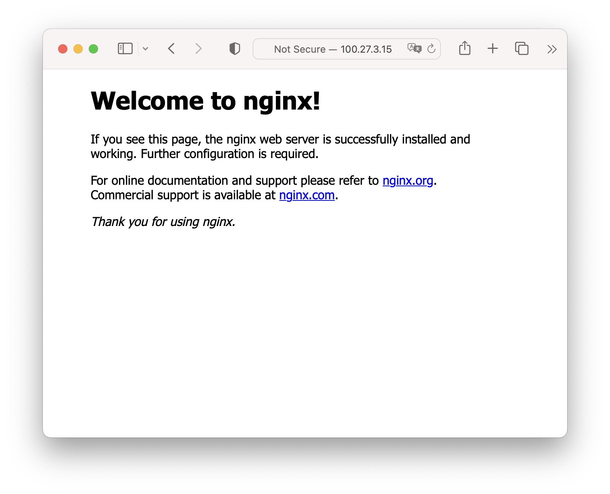
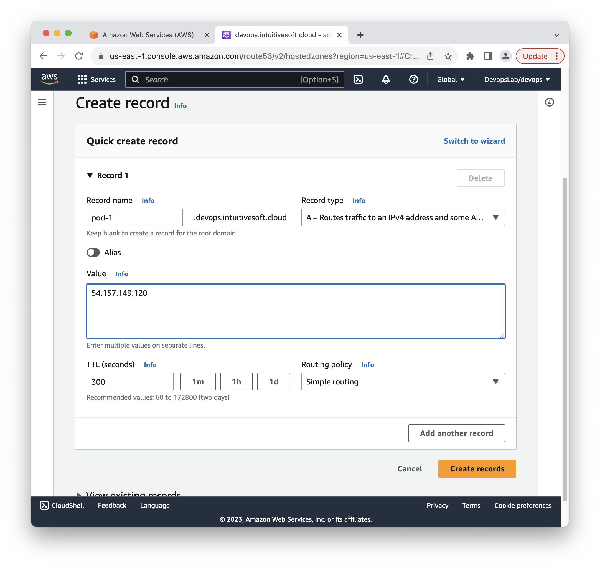

# LAB : Ansible Lab

**- Prerequisite and objective -**

Nginx is a widely used open-source web server and reverse proxy server. It's known for its high performance, scalability, and efficient handling of concurrent connections. Nginx can serve static content, act as a load balancer, and perform other tasks like SSL termination and caching, making it a popular choice for serving websites and applications.

Ansible is a powerful automation tool that simplifies and accelerates the process of setting up and configuring software on remote servers. When it comes to installing and configuring Nginx, Ansible can significantly streamline these tasks, making them repeatable, consistent, and efficient.

**This lab involves file editing. It's recommended to use the Lab Dashboard Code Editor and installing `Ansible` extension for VSCode**

**- Lab Diagram -**


## Insight 1. Ansible Connectivity

Ansible works by connecting to what you want automated and pushing programs that execute instructions that would have been done manually. 
These programs utilize Ansible modules that are written based on the specific expectations of the endpoint’s connectivity, interface, and commands. Ansible then executes these modules (over standard SSH by default), and removes them when finished (if applicable).
There are no additional servers, daemons, or databases required.

We differentiate the central node where ansible is running : `control node` from the node you are configuring the `managed hosts`

**- Control node -**

Unlike other configuration management utilities, ansible uses an agentless architecture (or 'temporary agent'). Ansible itself only needs to be installed on the host it will run referred as the `control node`.

Ansible installation on the control node requires Python 3.8 or newer installed.
Ansible is packaged as a python library.

**- Managed hosts -**

Although you do not need a daemon on your managed nodes, you do need a way for Ansible to communicate with them. For most managed nodes, Ansible makes a connection over SSH and transfers modules using SFTP.
If possible it's advisable for the managed host to run Python 3.5+.

## Task 2. Ansible Installation 

**-Task 2.1-**

Verify python version and install Ansible:

**This commands are run on Code Editor terminal**

```bash
python3 --version
```
Expected output

```
Python 3.9.2
```

**-Task 2.2-**

Install requirements

```bash
sudo apt install python3.9-venv python3-pip
```

Install pipx

```bash
python3 -m pip install pipx
```

Add pipx packages folder to PATH

```bash
echo 'export PATH=/home/coder/.local/bin:$PATH' >> ~/.bashrc
source ~/.bashrc 
```

**-Task 2.3-**

Install ansible

```bash
pipx install ansible-core
```

**-Task 2.4-**

Verify ansible installation
```bash
ansible --version
```

Expected output
```
ansible [core 2.12.6]
  config file = None
  configured module search path = ['/home/ubuntu/.ansible/plugins/modules', '/usr/share/ansible/plugins/modules']
  ansible python module location = /home/ubuntu/.local/lib/python3.8/site-packages/ansible
  ansible collection location = /home/ubuntu/.ansible/collections:/usr/share/ansible/collections
  executable location = /home/ubuntu/.local/bin/ansible
  python version = 3.8.10 (default, Mar 15 2022, 12:22:08) [GCC 9.4.0]
  jinja version = 3.1.2
  libyaml = True
```

## Task 3. Ansible project folder structure

A well-organized Ansible project folder structure can greatly improve the maintainability and scalability of your automation efforts.
An Ansible role is a reusable and modular unit of automation in Ansible. Roles are used to organize and encapsulate the configuration tasks and related files required to manage specific aspects of a system or application. Roles provide a structured way to manage and share automation code and make it easier to maintain and scale Ansible playbooks.


Generate a new empty role named `ansible-project` with the following command 

```bash
ansible-galaxy role init ansible-project
```

You should get the following created structure  :

```
ansible-project       # This hierarchy represents an Ansible project
├── README.md         # Documentation of your role
├── defaults          # Contains the default variables for the role.
│   └── main.yml
├── files             # Folder for static files
├── handlers          # Contains handlers, which are tasks that respond to a notify directive.
│   └── main.yml
├── meta              # Metadata for the role, like author, support, dependencies.
│   └── main.yml
├── tasks             # Generic tasks for playbooks
│   └── main.yml      
├── templates         # Files for use with the template resource
├── tests             # Contains tests for the role.
│   ├── inventory
│   └── test.yml
└── vars              # Variables files to be used in playbooks
    └── main.yml
```

## Insight 4. Inventory

A host inventory defines which hosts Ansible manages. Hosts may belong to groups which are typically used to identify the hosts role in the datacenter. A host can be a member of more than one group.

There are two ways in which host inventories can be defined. A static host inventory may be defined by a text file or a dynamic host inventory may be be generated from outside providers.

Note: it's a good practice to use SSH key-pair authentication from Control Node to Managed Hosts. And to enable passwordless sudo for the user ansible is using to connect to the Managed host.

**- Dynamic host inventory -**

Ansible host inventory information can also be dynamically generated. Source for dynamic inventory information include public/private cloud providers like AWS, GCP, Openstack or configuration management databases (CMDB).

A dynamic host inventory plugin is nothing but a python script that returns an Ansible formatted inventory structure.

**- Static host inventory -**

An ansible static host inventory is define in an ini-like text file or in YAML format.
In INI format, each section defines one group of hosts (a host group). Each section starts with a host group name enclosed in square brackets (`[]`). 
Then host entries for each managed host in the group are listed, one host per line.

A valid host entry follow the following syntax:
```
[<alias>] (<IP> | <Hostname>) [<parameter>=<value>...]
```

## Task 5. Create a static inventory

**- Task 5.1 -**

Inside your `ansible-project` folder create a new file named `inventory.ini` file with the following content to connect to your nginx server. **Update the ansible_host variable with your EC2 instance VM IP address and update the path to your SSH key**

```ini
[webservers]
nginx ansible_host=YOUR_NGINX_VM_IP_ADDRESS

[webservers:vars]
ansible_ssh_private_key_file=~/.ssh/my-private-key.pem 
ansible_user=ubuntu
```

This inventory defines :

- `webeservers` : The group name
- `nginx` : An Ansible managed host
  - `ansible_host` : The IP address or DNS entry to reach the managed host
- `webservers:vars` : A list of variables for the `webserver` group
  - `ansible_ssh_private_key_file` : The SSH key used to connect to your instances
  - `ansible_user` : The user to connect to your instances 

The full list of Ansible inventory parameters is [available on Ansible documentation.](https://docs.ansible.com/ansible/latest/user_guide/intro_inventory.html#connecting-to-hosts-behavioral-inventory-parameters)

**- Task 5.2 -**

The command line `ansible-inventory` verifies your inventory and can display it in different formats.

Issue the following command to validate the syntax of your inventory and its content structure 

```bash
ansible-inventory -i inventory.ini --list 
```

You should get the following output :

```json
{
    "_meta": {
        "hostvars": {
            "nginx": {
                "ansible_host": "REDACTED",
                "ansible_ssh_private_key_file": "~/.ssh/my-private-key.pem",
                "ansible_user": "ubuntu"
            }
        }
    },
    "all": {
        "children": [
            "ungrouped",
            "webservers"
        ]
    },
    "webservers": {
        "hosts": [
            "nginx"
        ]
    }
}
```

**- Task 5.3 -**

You can validate your inventory by asking ansible to connect to `all` the managed hosts you defined using a builtin Ansible module named `ping`

```bash
ansible all -i inventory.ini --module-name ping
```

Expected output

```
nginx | SUCCESS => {
    "ansible_facts": {
        "discovered_interpreter_python": "/usr/bin/python3"
    },
    "changed": false,
    "ping": "pong"
}
```

## Insight 6. YAML 

Ansible playbooks are written using the YAML (Yet Another Markup Language) language. Therefore it's necessary to understand the basics of YAML syntax to compose Ansible playbook.

YAML was designed primarily for the representation of data structure such as lists and associative arrays in an essay to write, human-readable format. 
This design objective is accomplished primarily by abandoning traditional enclose syntax, such as brackets, braces (JSON) or opening and closing tags (XML). Instead YAML data hierarchy structures are maintained using outline indentation.
There is no strict requirement regarding the number of space characters used for indentation other than elements must be further indented than their parents to indicate nested relationships.

Note : Indentation can only be performed using space character (no TAB). Indentation is very critical to the proper interpretation of YAML.
**It's highly recommended to use an IDE (You will suffer)**. Users of VIM can alter the TAB key when editing Yaml files to perform 2 spaces instead. 
```
autocmd FileType yaml setlocal ai ts=2 sw=2 et
```
**- Strings -**

string in YAML do not require enclosure in quotations. If desired, strings can enclosed in either double-quotes or single-quotes.

```yaml
description: a valid string
```
```yaml
description: 'a valid string'
```
```yaml
description: "a valid string"
```

**- List -**

```yaml
webservers:
  - web1
  - web2
  - web3
```

Python equivalent:

```python
webeservers = ['web1','web2','web3']
```

**- Dictionaries -**

```yaml
lab:
  name: devops
  subject: ansible
  date: 2023-09-01
```

Python equivalent:

```python
lab = { 
  'name' : 'devops',
  'subject' : 'ansible',
  'date' : '2023-09-01'
}
```

## Insight 7. Ansible Modules and Playbook

Modules are programs that Ansible uses to perform operations on managed hosts. They are ready-to-use tools designed to perform specific operations.

There are three types of Ansible modules:

1. Core modules : Ansible built-in modules shipped with ansible an maintained by the Ansible team
2. Galaxy Modules : Modules created/maintained by the community or the industry. They are distributed via 'ansible packet manager' ansible-galaxy. Each ansible release often promote to core most used community modules.
3. Custom Modules : Your own modules.

Ansible automation strategy is to converge to the target intent configuration state. Some tasks might be expected to fail during your initial deployment. You should be able to re-run the all tasks until configuration state is reached. 

In that consideration and because Ansible is stateless, modules *must* be idempotent. Each module *should* implement a logic to test if they need to be executed or not, modules must have a reliable predictive and consistent output. This is the main limitation of running Ansible in production. When using custom/community modules extensive testing of your automation plays must be done to prevent side effects on your infrastructure.

* [All ansible modules list available here](https://docs.ansible.com/ansible/2.9/modules/list_of_all_modules.html)

**- Modules usage -**

Technically a module is nothing more than a python script that accepts a dictionary as parameter input and output an Ansible formatted dictionary structure. 

A module is invoked in ansible using the following YAML syntax :

```yaml
ansible.builtin.copy:         #module name
  src: /etc/foo.conf          #module parameters
  dest: /etc/bar.conf     
```
* [Ansible copy module parameters github](https://github.com/ansible/ansible/blob/82f3a57bee274b52db8bbf1d1c072997f9c4f5f2/lib/ansible/modules/copy.py#L531)

When using a module always refer to the [module documentation](https://docs.ansible.com/ansible/latest/collections/ansible/builtin/index.html) and verify its parameters and usage.

Ansible modules can be used to perform operations on managed hosts using [simple ad hoc commands](https://docs.ansible.com/ansible/latest/user_guide/intro_adhoc.html) (like the the ping module used earlier). While it is useful for simple operations ad hoc commands are not suited for the challenges of complex configuration management and declarative automation.
Automating an infrastructure is the result of several `tasks`, performed by several `modules`. Several `tasks` are aggregated in a `playbook`. 

## Task 8. Create your first Playbook

**- Task 8.1 -**

A `Playbook` is a set of plays. A play must define a target inventory object (host or group) referred as `hosts` and a set of `tasks` performing that are a set of `modules`.

You are going to write a playbook to install a NGINX server on the target

Inside your ansible-nginx folder create a file named `nginx-install.yaml` with the following content :

```yaml
---                                         # Conventionally YAML file starts with '---'
- name: Simple nginx installation           # Descriptive play name
  gather_facts: yes                         # Gather `facts` on the target host and store them in `ansible_facts` variable
  hosts: webservers                         # Target managed hosts, tasks will run on/toward. 
  
  tasks:                                    # List of tasks for the play
  - name: Install nginx package             # Name of the task
    ansible.builtin.apt:                    # Module name 
      update_cache: yes                     
      pkg:                                  
        - nginx                             
      state: present                        
    become: true                            # Privilege escalation for the task
```

By default Ansible connect as the user defined in inventory/control node, for privilege escalation for a given task you can use the parameter `become: true` :

**- Task 8.2 -**

Execution of a playbook is done with the following command :

```bash
ansible-playbook -i inventory.ini nginx-install.yaml
```

Ansible treat each task atomically and will report a detailed report on success and status for each of them:


Expected output:

```
PLAY [Simple nginx installation] ***************************************************************************************************

TASK [Gathering Facts] ***************************************************************************************************************
ok: [nginx]

TASK [Install nginx package] *************************************************************************************
changed: [nginx]

PLAY RECAP ***************************************************************************************************************************
nginx                      : ok=2    changed=1    unreachable=0    failed=0    skipped=0    rescued=0    ignored=0   

```

Note: 
  * The command line parameter`-vvv` - very very verbose - can help with the troubleshooting.

## Task 9. Verify NGINX installation

**- Task 9.1 -**

Nginx host a default static website on port 80. Make appropriate change to your VM to allow external connections on port 80.

**- Task 9.2 -**

Open a new tab on a web browser and use your VM instance IP address and port 80

If the installation was successful you should have this result :



## Task 10. Create a DNS entry for your NGINX VM 

**-Task 10.1-**

Navigate to the `Route53 > Hosted zones` , or use the following link [https://us-east-1.console.aws.amazon.com/route53/v2/hostedzones?region=us-east-1#ListRecordSets/Z03385262WMCAFO2KASN1](https://us-east-1.console.aws.amazon.com/route53/v2/hostedzones?region=us-east-1#ListRecordSets/Z03385262WMCAFO2KASN1)

**-Task 10.2-**

Add a DNS record `A` to your EC2 instance public IP address




## Insight 11. Variables

Ansible supports variables that can be used to store values that can reused throughout files in an entire Ansible project. Variables provide a convenient way to manage dynamic values for a given environment in your Ansible project.

To correctly interact with Ansible, you need to apprehend Ansible variable scope and precedence system.

**- Scope -**

Variables in Ansible can be defined in a bewildering variety of places. However this can be simplified to three basic scope levels:

* Global scope : Variables set from the command line or Ansible Configuration
* Play scope: Variables set in a play and related structure
* Host scope: Variables set on host groups and individual hosts by the inventory, fact gathering or tasks.

**- Precedence -** 

At execution, your playbook will have access to the variables coming from the different scopes.
If the same variable name is defined at more than one level, the higher wins.

At high level, here is the order of precedence from least to greatest  :
 
1. inventory vars
2. playbook vars 
3. command line vars

For reference, the full detailed precedence rules are [available on ansible documentation](https://docs.ansible.com/ansible/latest/user_guide/playbooks_variables.html#understanding-variable-precedence) 

## Task. 12 Define playbook variables

**- Task. 12.1 -** 

Playbook variables can be defined in multiple ways. One of the simplest is to place it in a `vars` block at the beginning of a playbook.
Create a new playbook file named `test-variables.yaml` inside your ansible project with the following content :

```yaml
---                                         
- name: A test on variables usage          
  gather_facts: yes                         
  hosts: webservers
  
  vars:
    - user_name: devops 
```

It defines a single variable named `user_name` with value `devops`.

**- Task. 12.2 -**

If you meant to reuse same group of variables in different plays, it's advised to define your variables in a dedicated file inside your project `vars` folder and import the file in the different plays:

Create a variable file named `generic.yaml` inside your project `vars` folder with the following content :

**UPDATE THE DOMAIN NAME WITH YOUR VM DNS ENTRY**

```yaml
domain: YOUR-USERNAME.devops.intuitivesoft.cloud
```

**- Task. 12.3 -**

Then edit the `test-variables.yaml` playbook to add references of the generic.yml file :

```yaml
---                                         
- name:  A test on variables usage       
  gather_facts: yes                         
  hosts: webservers
  become: true
  
  vars:
    - user_name: user-1 
  
  vars_files:
    - vars/generic.yml
```

## Task 13. Use variables in playbooks

**- Task 13.1 -** 

Variables are referenced by placing the variable name in double curly braces.

Update the `test-variables.yaml` playbook and add a debug task to display information on the host

```yaml
---                                         
- name:  A test on variables usage       
  gather_facts: yes                         
  hosts: webservers
  
  vars:
    - user_name: devops 
  
  vars_files:
    - vars/generic.yaml
  
  tasks:
  - name: Print a message for debug       
    ansible.builtin.debug:                
      msg: "Connected to {{ domain }} - IP {{ ansible_host }} - For user {{ user_name }}. Managed host is running {{ ansible_distribution }} {{ ansible_distribution_version }}"
```

Variables are defined :

- `user_name` is defined at the playbook level.
- `domain` is defined in the `vars/generic.yml` file.
- `ansible_host` is defined in the inventory.
- `ansible_distribution` and `ansible_distribution_version` are defined dynamically by the `gather_facts: yes` module.


Although Ansible is lenient, make sure variables are in a double quote string `" "`, it will prevent errors later on. `{{ a_var }}` should be written `"{{ a_var }}"`.

You can have several variables in the same string.

**- Task 13.2 -** 

Execute the playbook.

```bash
ansible-playbook -i inventory.ini test-variables.yaml
```

You should get the following output :

```
PLAY [A test on variables usage] *********************************************************************************

TASK [Gathering Facts] *******************************************************************************************
ok: [nginx]

TASK [Print a message for debug] *********************************************************************************
ok: [nginx] => {
    "msg": "Connected to user-1.devops.intuitivesoft.cloud - IP 100.27.3.15 - For user devops. Managed host is running Ubuntu 22.04"
}

PLAY RECAP *******************************************************************************************************
nginx                      : ok=2    changed=0    unreachable=0    failed=0    skipped=0    rescued=0    ignored=0   
```

## Task 14. Create a virtual host Jinja2 template Nginx configuration file

Nginx virtual host, also known as server block, enables hosting multiple websites on a single server by directing incoming requests to different configurations based on domain names or IP addresses. Conventionally each host/site is defined in a dedicated configuration file.

You are going to dynamically generate the content of the configuration file using Jinja2.

Ansible uses the pythonic Jinja2 templating system to modify files before they are distributed to the managed hosts. 

Note: Jinja2 is the key templating engine of [Django](https://www.djangoproject.com) to render HTML pages.

A jinja template is a text file with variables or logic expressions placed between tags or delimiters.
At execution Jinja2 engine parses the text file for variables and renders it.

Variables are enclosed in double curly braces `{{ VAR }}`, much like variables in Ansible playbooks. While logic expressions are enclosed in ``.

**- Task 14.1 -**

Inside the `templates` folder create a file called `devops.conf.j2` with the following content :

```j2
server {
  listen 80 {{ 'default_server' if main_server }};
  listen [::]:80 {{ 'default_server' if main_server }};
  server_name {{ domain }};
  root /var/www/{{ domain }};
  location / {
    try_files $uri $uri/ =404;
  }
}
```

**- Task 14.2 -**

Create a new playbook file named `create-vhost.yaml` inside your ansible project with the following content :

```yaml
---                                         
- name: Configure a new virtualhost          
  gather_facts: yes                         
  hosts: webservers
  become: true
  
  vars_files:
    - vars/generic.yaml
  
  vars:
    - main_server : true

  tasks:  
  - name: "create www directory for your virtualhost"
    ansible.builtin.file:
      path: /var/www/{{ domain }}
      state: directory
      mode: '0775'
      owner: "{{ ansible_user }}"
      group: "{{ ansible_user }}"

  - name: delete default nginx site configuration
    ansible.builtin.file:
      path: /etc/nginx/sites-enabled/default
      state: absent
    notify: restart nginx

  - name: deploy new site configuration
    ansible.builtin.template:
      src: templates/devops.conf.j2
      dest: /etc/nginx/sites-enabled/{{ domain }}
      owner: root
      group: root
      mode: '0644'
    notify: restart nginx

  handlers:
    - name: restart nginx
      service:
        name: nginx
        state: restarted
```

Notes: 
- The ordering of the content within a playbook is important, tasks are evaluated top to bottom.
- `handlers` define tasks that are played only if any playbook task `changed` and `notify` it. 

**- Task 14.3 -**

Deploy your virtualhost

```bash
ansible-playbook -i inventory.ini create-vhost.yaml
```

```
PLAY [Configure a new virtualhost] ***************************************************************************************************

TASK [Gathering Facts] ***************************************************************************************************************
ok: [nginx]

TASK [create www directory for your virtualhost] *************************************************************************************
changed: [nginx]

TASK [delete default nginx site] *****************************************************************************************************
ok: [nginx]

TASK [copy nginx site.conf] **********************************************************************************************************
changed: [nginx]

RUNNING HANDLER [restart nginx] ******************************************************************************************************
changed: [nginx]

PLAY RECAP ***************************************************************************************************************************
nginx                      : ok=5    changed=3    unreachable=0    failed=0    skipped=0    rescued=0    ignored=0   

```

**- Task 14.4 -**

Verify that you can access to your VM DNS entry : http://USER-NAME.devops.intuitivesoft.cloud

No website yet exists access if forbidden, but the resolution is successful.

## Task 15. Idempotency 

In the context of automation and systems management, idempotency is a crucial concept. When designing scripts, configuration management systems, or automation tasks, ensuring idempotency means that running the same action multiple times will not lead to unexpected or undesirable outcomes. This property helps maintain consistent and predictable system states regardless of how many times the operation is executed.

Ansible modules *must* implement idempotency, let's verify this and re-run the previous playbook

```bash
ansible-playbook -i inventory.ini create-vhost.yaml
```

You should get the following output:

```
PLAY [Configure a new virtualhost] *******************************************************************************

TASK [Gathering Facts] *******************************************************************************************
ok: [nginx]

TASK [create www directory for your virtualhost] *****************************************************************
ok: [nginx]

TASK [delete default nginx site] *********************************************************************************
ok: [nginx]

TASK [copy nginx site.conf] **************************************************************************************
ok: [nginx]

PLAY RECAP *******************************************************************************************************
nginx                      : ok=4    changed=0    unreachable=0    failed=0    skipped=0    rescued=0    ignored=0   
```

Note that no task has `changed` hence the `handler` task `restart nginx` has not been notified. Nothing happened !