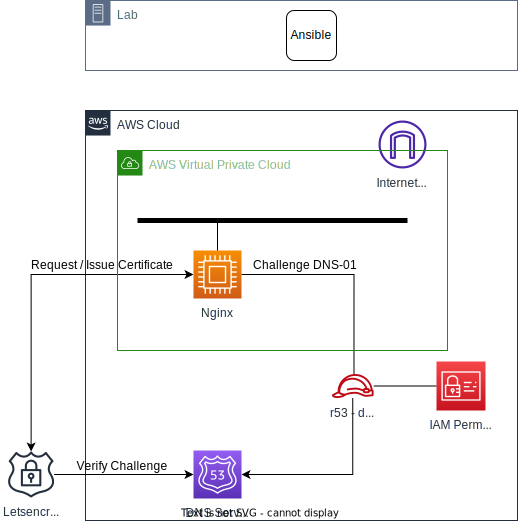
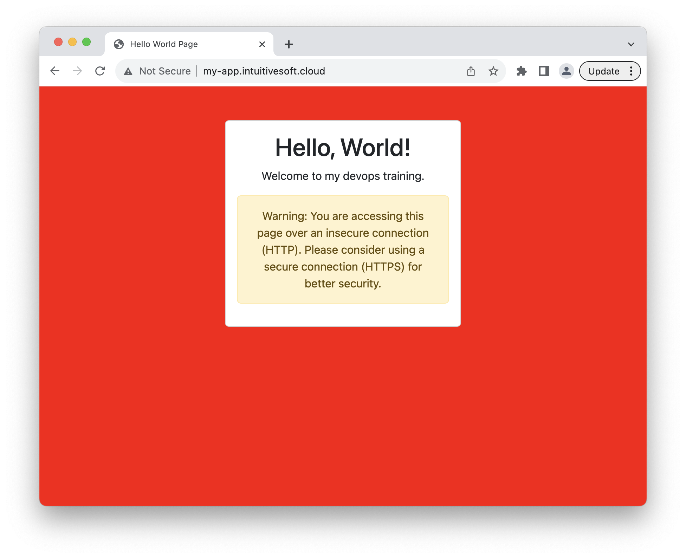
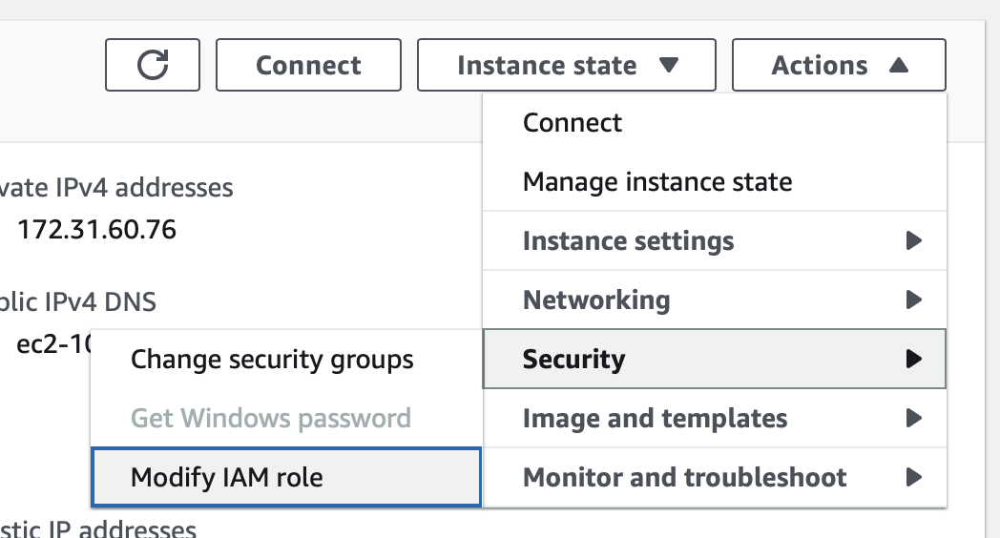
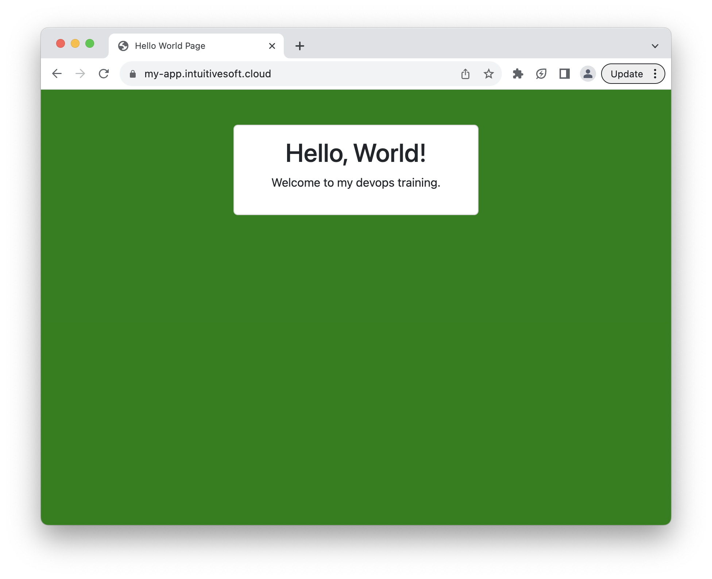

# LAB : Ansible NGINX SSL

In the following lab you will automate the deployment of a simple website and its SSL certificate using Ansible and [letsencrypt](https://letsencrypt.org).

Certbot is a popular open-source tool developed by the Electronic Frontier Foundation (EFF) that simplifies the process of obtaining and managing SSL/TLS certificates from Let's Encrypt. Let's Encrypt is a free and automated certificate authority that provides SSL/TLS certificates to secure websites.

When setting up an SSL certificate for an Nginx web server, Certbot streamlines the otherwise complex process into a few straightforward steps. It automates the certificate issuance, renewal, and Nginx configuration process, ensuring your website remains secure without manual intervention.

For Letsencrypt to issue a new certificate you need to answer a challenge to verify domain ownership.
The challenge method used in this lab will be DNS-01. During the certificate request process Letsencrypt awaits a TOKEN to be enter in a specific TXT entry under the domain you own. 

**Lab Diagram**



## Task 1. Create a playbook to deploy your website

Let's deploy a simple website that you will later on protect with HTTPS reverse-proxy.

**- Task 1.1 -**

Inside `files` folder create a `index.html` page with the following content :

```html
<!DOCTYPE html>
<html lang="en">
<head>
  <meta charset="UTF-8">
  <meta name="viewport" content="width=device-width, initial-scale=1.0">
  <title>Hello World Page</title>
  <link rel="stylesheet" href="https://cdn.jsdelivr.net/npm/bootstrap@5.3.0/dist/css/bootstrap.min.css">
</head>
<body>
  <div class="container mt-5">
    <div class="row justify-content-center">
      <div class="col-md-6">
        <div class="card">
          <div class="card-body text-center">
            <h1 class="card-title">Hello, World!</h1>
            <p class="card-text">Welcome to my devops training.</p>
            <div class="alert alert-warning" role="alert" id="HttpsCheck">
              Warning: You are accessing this page over an insecure connection (HTTP). Please consider using a secure connection (HTTPS) for better security.
            </div>
          </div>
        </div>
      </div>
    </div>
  </div>
  <script>
    // JavaScript to change the site's color based on the protocol
    const isSecure = window.location.protocol === 'https:';
    const body = document.querySelector('body');
    const httpMessage = document.getElementById('HttpsCheck');
    if (isSecure) {
      body.style.backgroundColor = 'green';
      httpMessage.classList.add('d-none');
    } else {
      body.style.backgroundColor = 'red';
    }
  </script>
</body>
</html>
```

**- Task 1.2 -**

Create a new ansible playbook named `deploy-website.yml`

With the following content :
```Yaml
- name: Deploy devops website
  gather_facts: yes                         
  hosts: webservers                  
  
  vars_files:
    - vars/generic.yml
  
  tasks:  
  - name: change index.html
    ansible.builtin.copy:
      src: files/index.html
      dest: /var/www/{{domain}}/index.html
      mode: '0775'
      owner: "{{ ansible_user }}"
      group: "{{ ansible_user }}"
    become: true
```

**- Task 1.3 -**

Execute your playbook:

```bash
ansible-playbook -i inventory.ini deploy-website.yml
```

You should get the following output :

```
PLAY [Deploy devops website] *********************************************************************************************************

TASK [Gathering Facts] ***************************************************************************************************************
ok: [nginx]

TASK [change index.html] *************************************************************************************************************
changed: [nginx]

PLAY RECAP ***************************************************************************************************************************
nginx                      : ok=2    changed=1    unreachable=0    failed=0    skipped=0    rescued=0    ignored=0   
```

**- Task 1.4 -**

Verify that your website is deployed by opening a web browser tab to your instance DNS entry.



## Insight 2. EC2 IAM Role

An EC2 IAM role is a powerful tool that enables Amazon EC2 instances to securely access and interact with AWS services without needing to manage long-term credentials. When it comes to updating Route 53 DNS records, you can create an IAM role with the necessary permissions to modify Route 53 hosted zones and resource record sets.

By assigning this IAM role to an EC2 instance, you grant it the authority to make changes to Route 53 records on your behalf. This is particularly useful for scenarios like dynamic IP address updates or automated DNS record management.

With the IAM role attached, the EC2 instance can utilize AWS SDKs or command-line tools like the AWS CLI to make authorized requests to Route 53. The IAM role ensures that the instance follows the principle of least privilege, only having the specific permissions needed for updating DNS records.

This approach enhances both security and automation. You avoid exposing long-term access keys on instances, reducing the risk of unauthorized access. Plus, by centralizing permissions through IAM roles, you simplify the management of permissions across instances and services.

## Task 3. Verify existing IAM EC2 role

**- Task 3.1 -**

An AWS EC2 IAM role named `r53-devops` already exist in your environnement let's visualize its content.

Using AWS CLI list the policies attached to the role :

```bash
aws iam list-attached-role-policies --role-name r53-devops
```

Expected output :

```json
{
    "AttachedPolicies": [
        {
            "PolicyName": "Letsencrypt-devops.intuitivesoft.cloud",
            "PolicyArn": "arn:aws:iam::708113109960:policy/Letsencrypt-devops.intuitivesoft.cloud"
        }
    ]
}
```

**- Task 3.2 -**

Visualize the content of the `Letsencrypt-devops.intuitivesoft.cloud` policy.

```bash
aws iam get-policy-version --policy-arn arn:aws:iam::708113109960:policy/Letsencrypt-devops.intuitivesoft.cloud --version-id v1
```

Expected output :

```json
{
    "PolicyVersion": {
        "Document": {
            "Version": "2012-10-17",
            "Id": "certbot-dns-route53 sample policy",
            "Statement": [
                {
                    "Effect": "Allow",
                    "Action": [
                        "route53:ListHostedZones",
                        "route53:GetChange"
                    ],
                    "Resource": [
                        "*"
                    ]
                },
                {
                    "Effect": "Allow",
                    "Action": [
                        "route53:ChangeResourceRecordSets"
                    ],
                    "Resource": [
                        "arn:aws:route53:::hostedzone/Z03385262WMCAFO2KASN1"
                    ]
                }
            ]
        },
        "VersionId": "v1",
        "IsDefaultVersion": true,
        "CreateDate": "2023-05-12T14:20:15+00:00"
    }
}
```

* The policy allows `List/Get` actions on every hosted zone on AWS.
* It allows to modify DNS `records` for the specific zone ID `Z03385262WMCAFO2KASN1`

## Task 4. Attach EC2 role to your instance

**Web UI**

Locate your EC2 instance click `Actions > Security > Modify IAM role`



From the dropdown menu select the `r53-devops` role an click `Update IAM role`

**CLI**

Update the value of INSTANCE_ID with the ID of your AWS EC2 instance

```bash
aws ec2 associate-iam-instance-profile --iam-instance-profile Name=r53-devops --instance-id INSTANCE_ID 
```

## Task 5. Allow HTTPS connections

Make appropriate changes to your VM to allow external connections on port 443.

## Task 6. Deploy certificate for your host

**- Task 6.1 -**

Create a new ansible playbook named `deploy-certificate.yml` with the following content :

```yaml
---
- name: Activate SSL certificate
  gather_facts: yes                         
  hosts: webservers
  become: true

  vars_files:
    - vars/generic.yaml

  tasks:  
  - name: install certbot
    community.general.snap:
      name:
        - certbot
      classic: true
  
  - name: set certbot privilege
    ansible.builtin.command: snap set certbot trust-plugin-with-root=ok

  - name: install certbot addons
    community.general.snap:
      name:
        - certbot-dns-route53
      classic: true

  - name: issue certificate
    ansible.builtin.command: certbot --non-interactive --redirect --agree-tos --nginx -d {{domain}} -m devops@intuitivesoft.cloud  
    notify: restart nginx
  
  handlers:
    - name: restart nginx
      service:
        name: nginx
        state: restarted
```

**- Task 6.2 -**

This playbook use a community library, you can download custom roles and collection using ansible-galaxy

```bash
ansible-galaxy collection install community.general
```

**- Task 6.3 -**

Finally deploy your certificate

```bash
ansible-playbook -i inventory.ini deploy-certificate.yml
```

Expected output :

```
PLAY [Activate SSL certificate] *********************************************************************

TASK [Gathering Facts] ******************************************************************************
ok: [nginx]

TASK [install certbot and addons] *******************************************************************
ok: [nginx]

TASK [issue certificate] ****************************************************************************
changed: [nginx]

RUNNING HANDLER [restart nginx] *********************************************************************
changed: [nginx]

PLAY RECAP ******************************************************************************************
nginx                      : ok=4    changed=2    unreachable=0    failed=0    skipped=0    rescued=0    ignored=0   
```

**- Task 6.2 -**

Verify that your website is now protected by a certificate and your are automatically redirected to HTTPS.



## Task 7. Visualize the NGINX configuration file

Using Ansible ad-hoc commend retrieve the content of your NGINX configuration file. 
It has been automatically updated by certbot with the SSL configuration.

```bash
ansible nginx -i inventory.ini --module-name command -a "cat /etc/nginx/sites-enabled/REDACTED.intuitivesoft.cloud"
```

Expected output:

```
nginx | CHANGED | rc=0 >>
server {
  server_name REDACTED.intuitivesoft.cloud;
  root /var/www/REDACTED.intuitivesoft.cloud;
  location / {
    try_files $uri $uri/ =404;
  }

    listen [::]:443 ssl ipv6only=on; # managed by Certbot
    listen 443 ssl; # managed by Certbot
    ssl_certificate /etc/letsencrypt/live/my-REDACTED.intuitivesoft.cloud/fullchain.pem; # managed by Certbot
    ssl_certificate_key /etc/letsencrypt/live/REDACTED.intuitivesoft.cloud/privkey.pem; # managed by Certbot
    include /etc/letsencrypt/options-ssl-nginx.conf; # managed by Certbot
    ssl_dhparam /etc/letsencrypt/ssl-dhparams.pem; # managed by Certbot

}server {
    if ($host = REDACTED.intuitivesoft.cloud) {
        return 301 https://$host$request_uri;
    } # managed by Certbot


  listen 80 default_server;
  listen [::]:80 default_server;
  server_name REDACTED.intuitivesoft.cloud;
    return 404; # managed by Certbot
}
```