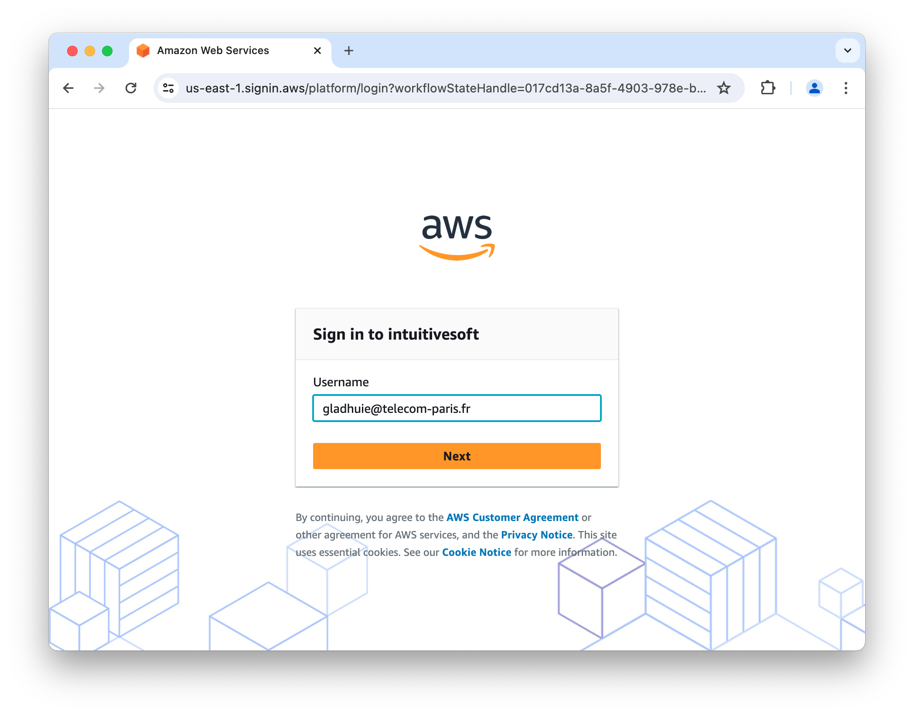
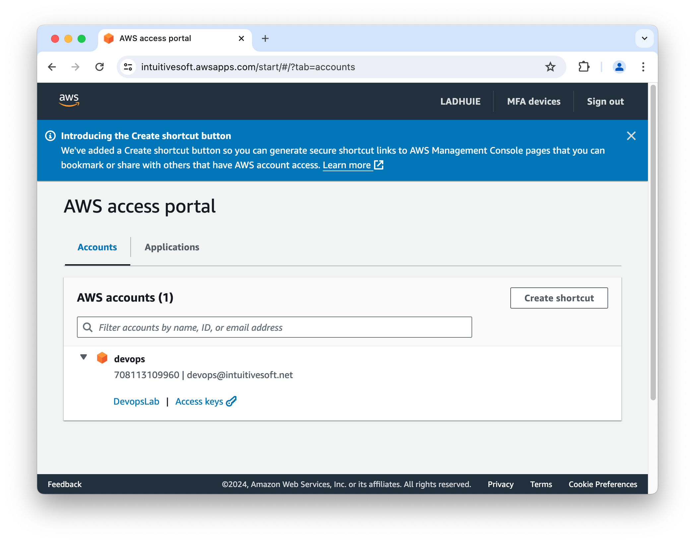

# AWS First Connect

## First connection

### Task 1. Email Verification
   
For your first connection you should have received an email verification from AWS. 

**If you did not received the verification email reach out to an instructor.**

### Task 2. First Login

Proceed to account login page or open the following URL  :
[__https://intuitivesoft.awsapps.com/start#/__](https://intuitivesoft.awsapps.com/start#/)

Enter your login username by default it's your email address. 

**If you are unsure about your login username please reach out to an instructor**

### Task 3. Verification code

Once your account is verified, a Verification code will be sent to your contact email.

### Task 4. New Password

Set a new compliant password for your account.

### Task 5. AWS management Console Login

You can now connect to the AWS management console.

## Connect to AWS Management console

Connect to the AWS management console using the training SSO portal : 

 [__https://intuitivesoft.awsapps.com/start#/__](https://intuitivesoft.awsapps.com/start#/)

Select your training AWS account and click the link  `Management console` to get access to the account main page.

AWS Cloud infrastructure is segmented in administrative regions
Once connected verify and switch to the lab region : *us-east-1*

The most convenient way to navigate in between AWS services is to use the research bar on the top side and type the name of the service, or feature inside a service, you'd like to access.

