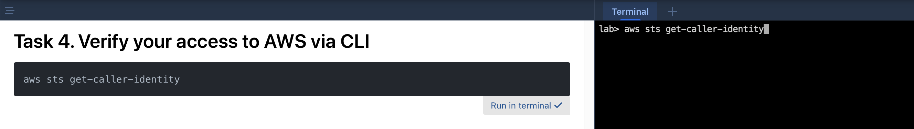
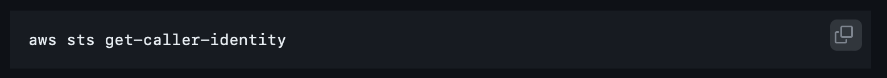
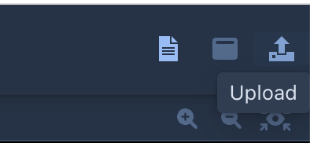
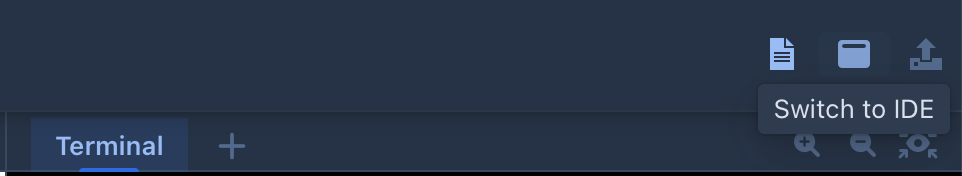
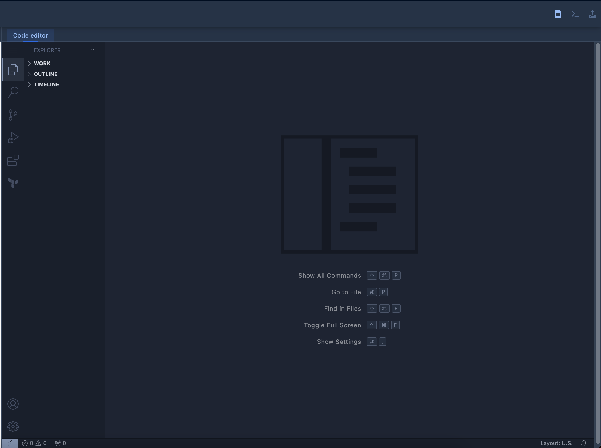
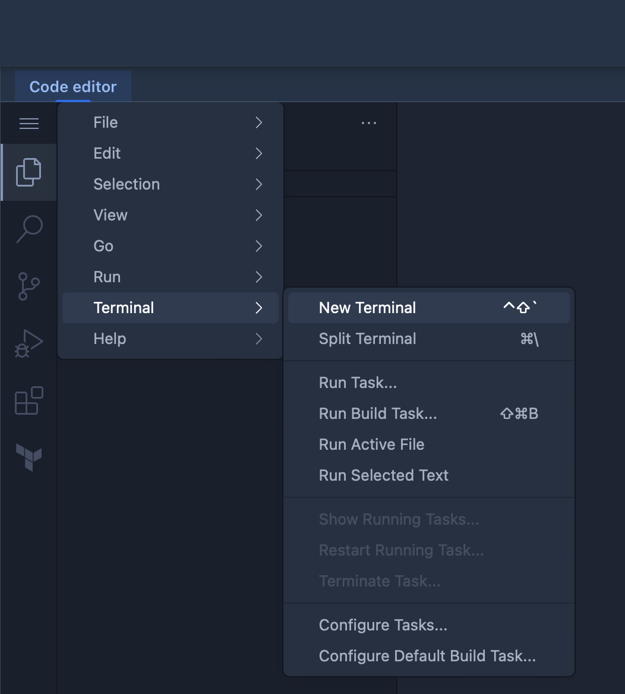

# Annex : Intuitive Lab Dashboard

## Terminal

By default the lab dashboard layout offers a live shell terminal to interact with your live lab instance.

From the training instructions you will have the possibility to inject command lines directly to the shell prompt using the `Run in Terminal` box.

Note : This option is only available in `Terminal View`

Alternatively you can copy the content of box using the copy feature on the box top right corner.

## Upload files to Lab Dashboard

You can upload files to your lab instance using the device browser `Upload` :

Files are stored in `~/files` folder.

Alternatively you can copy/paste or drag and drop files using Visual Studio Code `File Explorer`.

## Visual Studio Code

From your lab environment a Visual Studio Code server is available to interact with your working VM.

From your lab dashboard you can switch from `Terminal` to `IDE` view.

It opens the live code editor.

1. File explorer
2. Extensions Manager

**- File Explorer -**

In the file explorer you can interact with the files and folder in workspace.

Your lab workspace is in `/home/ubuntu/work` folder.

**- Extensions Manager -**

From the extensions manager menu you can install plugins to add functionality to VSCode based on the programming language or the solution your are working on. 

The full list of compatible plugins is available here : [https://open-vsx.org](https://open-vsx.org) 

**- Terminal -**

To open a new shell terminal to your working environment click `menu > Terminal > New Terminal`

## Upload files to IDE

Just drag and drop files and folder
