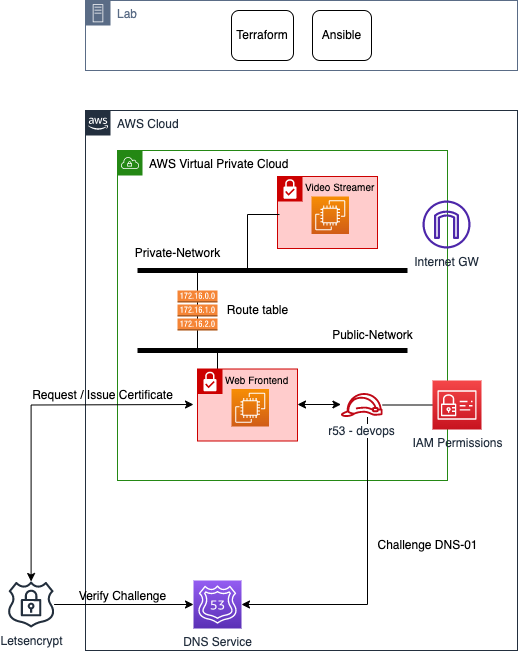

# AWS Video Streaming App Automation project

- [AWS Video Streaming App Automation project](#aws-video-streaming-app-automation-project)
  - [Objectives](#objectives)
  - [Application architecture](#application-architecture)
  - [Automation steps](#automation-steps)
  - [Project guidelines](#project-guidelines)

---

## Objectives

The project aims to develop an automation environment to deploy a Video Streaming service deployed on AWS public cloud.

You will reuse the knowledge from the previous sessions to deploy the necessary network infrastructure (VPC, Internet Gateway, Subnets, Routing Table) and 2x VMs (EC2 instance) to run the video and web applications following a 2-tier design pattern.

One VM (Video Streamer) runs a Video Streamer application to stream video towards the other VM (Web Frontend). The Web Frontend VM ingests stream from the Video Streamer app and serves the video to the end users via HTTPS.

End users can only access the Web Frontend using HTTPS on port 443, and have no access to the Video Streamer. Web Frontend has a valid SSL certificated. Communication between Video Streamer and Web Frontend is restricted to the only necessary ports required for stream ingestion.

---

## Application architecture

The diagram below highlights the target architecture which needs to be deployed and configured (through an automated process):

---

## Automation steps

The different steps we foresse for the automation process are highlighted below:

1. TF AWS: the procedure includes the deployment of 2xEC2 instances (Video Streamer, Web Frontend) as well as VPC, Internet Gateway, Subnets, Routing Table or Routes. *It has been already done in a previous session during the Terraform lab.*
2. Ansible: the procedure includes the installation/configuration of the NGINX application on the Web Frontend EC2 instance and FFmpeg on the Video Streamer instance. *It has been almost done in a previous session during the Ansible lab.*

---

## Project guidelines

---
